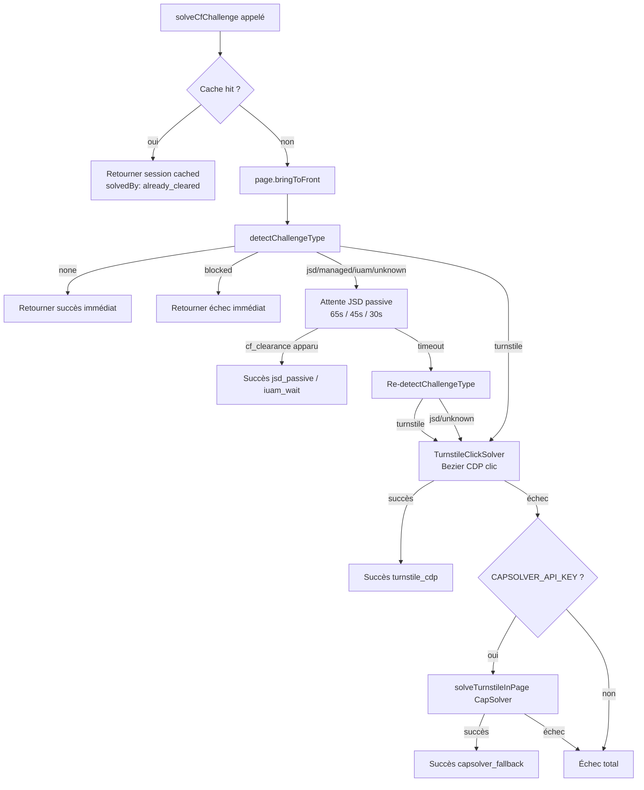
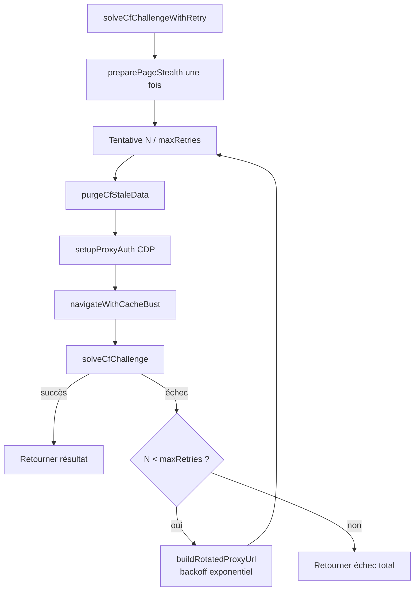

# Design Document — cf-challenge-solver-v2

## Overview

Ce document décrit la réécriture du module `artifacts/slot-hunter/src/cf-challenge-solver.ts`
en v2. L'objectif est d'améliorer la détection fine des challenges Cloudflare, d'enrichir
les patches stealth (inspirés du SeleniumBase UC Mode / CDP Mode), d'ajouter un cache TTL
pour les sessions `cf_clearance`, et d'orchestrer les tentatives avec rotation d'IP Decodo —
le tout en conservant une rétrocompatibilité totale des exports publics.

Le module reste un **fichier TypeScript unique** (pas de split en sous-fichiers) afin de
préserver la compatibilité des imports existants et d'éviter toute dépendance circulaire.
Les cinq composants internes (ChallengeDetector, StealthManager, TurnstileClickSolver,
SessionCache, CfSolverOrchestrator) sont des sections logiques dans le même fichier.

### Objectifs clés

- Taux de résolution ≥ 90 % sur `citaconsular.es` (Cloudflare Managed Challenge)
- Durée médiane de résolution ≤ 30 s pour les challenges JSD passifs
- Zéro dépendance npm supplémentaire (utilisation des imports existants)
- Compilation sans erreur en mode TypeScript strict (`tsc --noEmit --strict`)
- Rétrocompatibilité totale : aucun module appelant ne doit être modifié

---

## Architecture

```
cf-challenge-solver.ts (fichier unique, ~1 200 lignes)
│
├── ── Types & Interfaces ───────────────────────────────────────────
│   CfChallengeType, CfSession, CachedSessionResult, CacheMetrics,
│   CfSolveResult, CfSolveOptions, CfSolveWithRetryOptions
│
├── ── SessionCache (singleton module-level) ────────────────────────
│   Map<string, CfSession>, getCachedSession(), setCachedSession(),
│   invalidateSession(), getCacheMetrics(), disk persistence optionnelle
│
├── ── ChallengeDetector ────────────────────────────────────────────
│   detectChallengeType(page) : page.evaluate() → signaux DOM + _cf_chl_opt
│   Priorité : blocked > none > iuam > turnstile > managed > jsd > unknown
│
├── ── StealthManager ───────────────────────────────────────────────
│   preparePageStealth(page, ua?, geoTimezone?) : evaluateOnNewDocument()
│   Patches : webdriver Proxy, AudioContext noise, Canvas noise,
│             Battery API, navigator.connection, timezone, plugins, WebGL, chrome
│
├── ── TurnstileClickSolver ─────────────────────────────────────────
│   solveTurnstileByClick(page, options) : Bezier CDP + scroll
│   findTurnstileIframe(), computeTurnstileClickCoords(), humanLikeCdpClick()
│
├── ── CfSolverOrchestrator ─────────────────────────────────────────
│   solveCfChallenge(page, options)           : résolution simple
│   solveCfChallengeWithRetry(page, browser, options) : retry + rotation IP
│   purgeCfStaleData(), navigateWithCacheBust(), buildRotatedProxyUrl()
│
└── ── Exports publics ──────────────────────────────────────────────
    Fonctions v1 + nouvelles fonctions SessionCache + utilitaires internes
```

### Diagramme de flux de résolution



### Diagramme de flux retry




---

## Components and Interfaces

### 1. ChallengeDetector

**Fonction :** `detectChallengeType(page: Page): Promise<CfChallengeType>`

Un seul appel `page.evaluate()` collecte tous les signaux en une seule traversée DOM,
évitant les round-trips multiples vers le processus renderer.

**Ordre de priorité des signaux (du plus fort au plus faible) :**

| Priorité | Signal | Type retourné |
|----------|--------|---------------|
| 1 | Titre contient "Access Denied" / "Error 1015" / "Error 1020" | `"blocked"` |
| 2 | `cf_clearance` présent **ET** aucun autre signal CF | `"none"` |
| 3 | `#cf-please-wait` présent OU titre "Under Attack" / "ddos" **ET** pas d'iframe Turnstile | `"iuam"` |
| 4 | Iframe `src` contient `challenges.cloudflare.com` OU `_cf_chl_opt.cType === "interactive"` | `"turnstile"` |
| 5 | `_cf_chl_opt.cType === "managed"` | `"managed"` |
| 6 | `_cf_chl_opt.cType === "non-interactive"` ou `"jsd"` | `"jsd"` |
| 7 | Titre "Just a moment" / "Checking" / éléments `.cf-challenge-running` | `"jsd"` |
| 8 | Aucun signal mais aucun contenu substantiel | `"unknown"` |
| 9 | Page avec contenu, pas de signal CF | `"none"` |

**Différenciation `managed` vs `iuam` :**
- `managed` : `_cf_chl_opt` présent, pas de `#cf-please-wait` actif sans cType
- `iuam` : `#cf-please-wait` présent **sans** `_cf_chl_opt.cType === "managed"`

Cette distinction est critique car les timeouts d'attente JSD diffèrent (30 s vs 45 s).

---

### 2. StealthManager

**Fonction :** `preparePageStealth(page: Page, ua?: string, geoTimezone?: string): Promise<void>`

Tous les patches sont appliqués via `page.evaluateOnNewDocument()` — ils persistent
à travers toutes les navigations de la session. Idempotent : appelable plusieurs fois
sans exception ni double-application visible.

**Patches v1 conservés :**
- `navigator.webdriver` → `undefined`
- `navigator.plugins` + `navigator.mimeTypes` (PDF Viewer simulé)
- `WebGLRenderingContext.getParameter` (UNMASKED_VENDOR/RENDERER → Intel)
- `window.chrome` enrichi (app, csi, loadTimes, runtime)
- `navigator.permissions.query` ("notifications" → "prompt")
- Client Hints CDP (`Network.setUserAgentOverride`)
- TURNSTILE_INTERCEPT_SCRIPT
- Dialog handler (alert/confirm/prompt)

**Nouveaux patches v2 :**

| Patch | Implémentation | Justification |
|-------|---------------|---------------|
| `navigator.webdriver` Proxy trap | `Object.defineProperty` avec getter retournant `undefined` via Proxy-like | Détection plus forte que simple `defineProperty` |
| AudioContext noise | Patch `AudioBuffer.prototype.getChannelData` + `AnalyserNode.prototype.getFloatFrequencyData` avec bruit déterministe `sessionSalt` | CF fingerprinte le hash audio |
| Canvas noise | Patch `HTMLCanvasElement.prototype.toDataURL` avec 1 pixel modifié via `sessionSalt` | CF fingerprinte le canvas hash |
| Battery API | `navigator.getBattery` → `{ charging: true, chargingTime: 0, dischargingTime: Infinity, level: 1.0 }` | Headless Chrome n'expose pas Battery API |
| `navigator.connection` | `{ effectiveType: "4g", downlink: 10, rtt: 50, saveData: false }` | Headless n'a pas de connexion réseau simulée |
| Timezone alignment | Patch `Intl.DateTimeFormat` + `Date.prototype.getTimezoneOffset` si `geoTimezone` fourni | Cohérence proxy IP → timezone |

**Note sur le `sessionSalt` :** Un entier aléatoire (`Math.floor(Math.random() * 1000)`)
généré une fois au `evaluateOnNewDocument`. Toutes les fonctions de bruit l'utilisent
pour produire des valeurs déterministes par session mais uniques entre sessions.

`page.bringToFront()` est appelé dans `solveCfChallenge()` avant la détection, pas dans
`preparePageStealth()`, pour simuler un onglet au premier plan au moment de la résolution.

---

### 3. TurnstileClickSolver

**Fonction :** `solveTurnstileByClick(page: Page, options: CfSolveOptions): Promise<CfSolveResult>`

**Séquence d'exécution :**
1. Délai post-navigation : `1 500 + random() * 2 000 ms` (1.5–3.5 s)
2. Trouver l'iframe Turnstile via `findTurnstileIframe()`
3. Vérifier visibilité dans viewport → `window.scrollBy()` si hors-écran
4. `computeTurnstileClickCoords()` : bounding box + offset checkbox (x+33, y+height/2)
5. `humanLikeCdpClick()` : trajectoire Bezier cubique + délais timing humains
6. Attendre résolution (polling `isTurnstileResolved()` jusqu'à `postClickWait`)
7. Retry jusqu'à `maxTurnstileClicks` (défaut 5)

**Sous-fonctions exposées comme utilitaires (exports internes) :**
- `findTurnstileIframe(page)` — sélecteurs CF + fallback scan toutes iframes
- `computeTurnstileClickCoords(iframe)` — boundingBox + jitter ±5px
- `humanLikeCdpClick(page, x, y)` — CDP `Input.dispatchMouseEvent`

---

### 4. SessionCache

**Singleton module-level.** État partagé par toutes les invocations dans le même process.

**Interface publique exportée :**
```typescript
getCachedSession(domain: string): CachedSessionResult | null
setCachedSession(domain: string, session: CfSession): void
invalidateSession(domain: string): void
getCacheMetrics(): CacheMetrics
```

**Persistence disque** (optionnelle via `CF_SESSION_CACHE_FILE`) :
- Chargement au premier appel à `getCachedSession` ou `setCachedSession`
- Écriture synchrone (`fs.writeFileSync`) à chaque `setCachedSession`
- Format : JSON array de `[domain, CfSession]`
- Les entrées expirées sont filtrées au chargement

---

### 5. CfSolverOrchestrator

**Fonctions publiques :**
- `solveCfChallenge(page, options)` — résolution simple sans retry
- `solveCfChallengeWithRetry(page, browser, options)` — retry + rotation IP

**Cascade de stratégies dans `solveCfChallenge` :**

```
1. Cache check → si hit valide : retourner immédiatement (solvedBy: "already_cleared")
2. page.bringToFront()
3. detectChallengeType() → "blocked" / "none" : court-circuit immédiat
4. [jsd/managed/iuam/unknown] : waitForClearance(passiveTimeout)
   passiveTimeout : jsd=65s, iuam=45s, managed=30s, unknown=65s
5. Si timeout JSD : re-detectChallengeType()
   - Si turnstile → solveTurnstileByClick()
   - Si jsd/unknown → forcer solveTurnstileByClick() (CF peut afficher checkbox invisible)
6. [turnstile] : solveTurnstileByClick() directement (pas d'attente JSD)
7. Si tout échoue + CAPSOLVER_API_KEY : solveTurnstileInPage() fallback
8. Mettre en cache si succès
```

**Retry dans `solveCfChallengeWithRetry` :**
- Backoff : `min(2^(attempt-1) * 2 000, 20 000) ms`
- Rotation IP : `buildRotatedProxyUrl()` avant chaque nouvelle tentative
- `purgeStaleData` + `navigateWithCacheBust` avant chaque tentative


---

## Data Models

```typescript
// ── Types de challenges ──────────────────────────────────────────────────────

type CfChallengeType =
  | "jsd"            // JS Detection — résolution passive (PoW + fingerprint)
  | "managed"        // Managed Challenge — CF décide JSD ou Turnstile
  | "turnstile"      // Turnstile interactif (checkbox visible)
  | "turnstile_invis"// Turnstile invisible (PoW silencieux)
  | "iuam"           // Under Attack Mode
  | "blocked"        // IP bloquée / Access Denied
  | "none"           // Pas de challenge
  | "unknown";       // Type indéterminé

// ── Session CF clearance ─────────────────────────────────────────────────────

interface CfSession {
  cfClearance: string;
  cookies: Array<{ name: string; value: string }>;
  obtainedAt: number;   // Date.now() au moment de l'obtention
  expiresAt: number;    // Date.now() + TTL (lu depuis le cookie CF, ~2h)
}

// ── Résultat du cache ────────────────────────────────────────────────────────

interface CachedSessionResult {
  session: CfSession;
  isValid: boolean;       // true si Date.now() < expiresAt
  nearExpiry: boolean;    // true si TTL restant < 5 min
  ttlRemainingMs: number; // expiresAt - Date.now()
}

// ── Métriques du cache ───────────────────────────────────────────────────────

interface CacheMetrics {
  totalSolves: number;
  cacheHits: number;
  cacheMisses: number;
  averageSolveDurationMs: number;
}

// ── Résultat de résolution ───────────────────────────────────────────────────

interface CfSolveResult {
  success: boolean;
  challengeType: CfChallengeType;
  cfClearance?: string;
  durationMs: number;
  solvedBy?: "already_cleared" | "jsd_passive" | "iuam_wait" | "turnstile_cdp" | "capsolver_fallback";
  error?: string;
  allCookies?: Array<{ name: string; value: string }>;
}

// ── Options de résolution simple ─────────────────────────────────────────────

interface CfSolveOptions {
  timeout?: number;                  // défaut: 90 000 ms
  targetUrl?: string;
  maxTurnstileClicks?: number;       // défaut: 5
  clickRetryDelay?: number;          // défaut: 2 000 ms
  enableCapsolverFallback?: boolean; // défaut: true
  capsolverApiKey?: string;
  geoTimezone?: string;              // NOUVEAU v2: "Europe/Madrid", "Europe/Paris", etc.
}

// ── Options retry + rotation IP ─────────────────────────────────────────────

interface CfSolveWithRetryOptions extends CfSolveOptions {
  maxRetries?: number;       // défaut: 5
  proxyUrl?: string;
  purgeStaleData?: boolean;  // défaut: true
  cacheBustCdn?: boolean;    // défaut: true
  cfDomain?: string;         // détecté depuis targetUrl si absent
}

// ── Signal de détection interne (retour de page.evaluate) ───────────────────

interface CfPageSignals {
  title: string;
  url: string;
  isMoment: boolean;
  isChecking: boolean;
  isBlocked: boolean;
  isAttack: boolean;
  hasChallengeRunning: boolean;
  hasTurnstileIframe: boolean;
  hasChallengeForm: boolean;
  hasPleaseWait: boolean;
  hasCfOpt: boolean;
  cfChlType: string;
  hasTurnstileWidget: boolean;
  hasContent: boolean;
  bodyLength: number;
}
```

---

## Bezier Curve Algorithm

L'algorithme génère une trajectoire de souris humaine entre un point de départ aléatoire
et la cible, avec un profil de vitesse naturel (lent au début et à la fin, rapide au milieu).

```
Courbe de Bézier cubique :
  B(t) = (1-t)³·P0 + 3(1-t)²t·P1 + 3(1-t)t²·P2 + t³·P3
  avec t ∈ [0, 1]

Points de contrôle :
  P0 = (400 ± 200, 300 ± 200)          — départ aléatoire dans la fenêtre
  P1 = P0 + (±300, ±200)               — 1er point de contrôle (direction initiale)
  P2 = target + (±100, ±100)           — 2ème point de contrôle (arrivée)
  P3 = target                           — destination exacte

Nombre de points intermédiaires :
  N = floor(20 + random() * 20)         — entre 20 et 40

Paramétrage temporel par point i :
  t_i = i / N
  speed_factor = sin(t_i * π)           — 0→1→0 (lent aux extrémités)
  delay_i = 2 + (1 - speed_factor) * 16 — 2 ms (milieu) à 18 ms (extrémités)

Timing post-trajectoire :
  Délai pré-clic  : 80 + random() * 170 ms    (80–250 ms, réflexion humaine)
  Durée clic      : 40 + random() * 110 ms    (40–150 ms, durée naturelle)
  Jitter release  : ±3 px sur X et Y          (tremblement de la main)
```

**Implémentation TypeScript :**

```typescript
function cubicBezier(
  p0: { x: number; y: number },
  p1: { x: number; y: number },
  p2: { x: number; y: number },
  p3: { x: number; y: number },
  t: number,
): { x: number; y: number } {
  const u = 1 - t;
  return {
    x: u * u * u * p0.x + 3 * u * u * t * p1.x + 3 * u * t * t * p2.x + t * t * t * p3.x,
    y: u * u * u * p0.y + 3 * u * u * t * p1.y + 3 * u * t * t * p2.y + t * t * t * p3.y,
  };
}

async function generateBezierTrajectory(
  targetX: number,
  targetY: number,
): Promise<Array<{ x: number; y: number; delayMs: number }>> {
  const p0 = { x: 400 + (Math.random() - 0.5) * 400, y: 300 + (Math.random() - 0.5) * 400 };
  const p1 = { x: p0.x + (Math.random() - 0.5) * 600, y: p0.y + (Math.random() - 0.5) * 400 };
  const p2 = { x: targetX + (Math.random() - 0.5) * 200, y: targetY + (Math.random() - 0.5) * 200 };
  const p3 = { x: targetX, y: targetY };
  const N = Math.floor(20 + Math.random() * 20);

  return Array.from({ length: N + 1 }, (_, i) => {
    const t = i / N;
    const speedFactor = Math.sin(t * Math.PI);
    const delayMs = 2 + (1 - speedFactor) * 16;
    return { ...cubicBezier(p0, p1, p2, p3, t), delayMs };
  });
}
```

---

## SessionCache Implementation

```typescript
// ── État singleton module-level ──────────────────────────────────────────────

const _sessionCache = new Map<string, CfSession>();
const NEAR_EXPIRY_THRESHOLD_MS = 5 * 60 * 1_000; // 5 minutes

let _metrics: CacheMetrics = {
  totalSolves: 0,
  cacheHits: 0,
  cacheMisses: 0,
  averageSolveDurationMs: 0,
};
let _totalSolveDurationMs = 0; // accumulateur pour la moyenne

// ── Lecture ──────────────────────────────────────────────────────────────────

function getCachedSession(domain: string): CachedSessionResult | null {
  const session = _sessionCache.get(domain);
  if (!session) return null;

  const now = Date.now();
  if (now >= session.expiresAt) {
    _sessionCache.delete(domain);
    return null; // expiré → purgé
  }

  const ttlRemainingMs = session.expiresAt - now;
  return {
    session,
    isValid: true,
    nearExpiry: ttlRemainingMs < NEAR_EXPIRY_THRESHOLD_MS,
    ttlRemainingMs,
  };
}

// ── Écriture ─────────────────────────────────────────────────────────────────

function setCachedSession(domain: string, session: CfSession): void {
  _sessionCache.set(domain, session);
  _persistCacheToDisk(); // no-op si CF_SESSION_CACHE_FILE absent
}

// ── Invalidation ─────────────────────────────────────────────────────────────

function invalidateSession(domain: string): void {
  _sessionCache.delete(domain);
}

// ── Métriques ────────────────────────────────────────────────────────────────

function getCacheMetrics(): CacheMetrics {
  return { ..._metrics }; // copie défensive
}

function _recordSolve(durationMs: number): void {
  _metrics.totalSolves++;
  _totalSolveDurationMs += durationMs;
  _metrics.averageSolveDurationMs = _totalSolveDurationMs / _metrics.totalSolves;
}

function _recordCacheHit(): void  { _metrics.cacheHits++; }
function _recordCacheMiss(): void { _metrics.cacheMisses++; }
```

**Persistence disque :** Quand `CF_SESSION_CACHE_FILE` est défini, `_persistCacheToDisk()`
sérialise `[...sessionCache.entries()]` en JSON et écrit avec `fs.writeFileSync`.
Au démarrage, `_loadCacheFromDisk()` est appelé une seule fois et filtre les entrées expirées.
En cas d'erreur d'I/O, un warning est loggé mais le cache mémoire reste opérationnel.


---

## Correctness Properties

*A property is a characteristic or behavior that should hold true across all valid executions of a system — essentially, a formal statement about what the system should do. Properties serve as the bridge between human-readable specifications and machine-verifiable correctness guarantees.*

### Property 1: Soundness de la détection — aucun signal CF → `"none"`

*For any* mock page state where tous les signaux CF sont absents (`_cf_chl_opt` absent, titre neutre, pas d'éléments DOM CF, pas d'URL `/cdn-cgi/`), `detectChallengeType` SHALL retourner `"none"`, indépendamment du contenu textuel de la page.

**Validates: Requirements 1.1, 1.9**

---

### Property 2: Completeness de la détection — mapping cType → CfChallengeType

*For any* valeur de `_cf_chl_opt.cType` parmi `{ "managed", "interactive", "non-interactive", "jsd" }`, `detectChallengeType` SHALL retourner le type correspondant : `"managed"` pour `"managed"`, `"turnstile"` pour `"interactive"`, `"jsd"` pour `"non-interactive"` et `"jsd"`.

**Validates: Requirements 1.2, 1.3, 1.8**

---

### Property 3: Priorité blocked — bloqué avant tout autre signal

*For any* page dont le titre contient "Access Denied", "Error 1015", ou "Error 1020", `detectChallengeType` SHALL retourner `"blocked"` même si d'autres signaux CF sont simultanément présents (titre "Just a moment" + `_cf_chl_opt`).

**Validates: Requirements 1.5**

---

### Property 4: Invariants TTL du SessionCache

*For any* session `CfSession` avec un `expiresAt` arbitraire, les propriétés suivantes SHALL toujours tenir :
- Si `Date.now() < session.expiresAt` → `getCachedSession(domain)` retourne `{ isValid: true }`
- Si `Date.now() >= session.expiresAt` → `getCachedSession(domain)` retourne `null`
- Si `session.expiresAt - Date.now() < 5 * 60 * 1000` ET la session n'est pas expirée → `nearExpiry === true`

**Validates: Requirements 5.2, 5.3, 5.4**

---

### Property 5: Borne stricte du retry

*For any* valeur de `maxRetries` ∈ [1, 10], le nombre total de tentatives exécutées par `solveCfChallengeWithRetry` SHALL toujours être ≤ `maxRetries`, quelle que soit la séquence d'échecs ou de succès retournée par les solvers internes mockés.

**Validates: Requirements 6.1**

---

### Property 6: Monotonie et borne du backoff exponentiel

*For any* séquence de tentatives numérotées 1..N, le délai avant la tentative k SHALL être `min(2^(k-1) * 2000, 20000)` ms. En particulier :
- `delays[i+1] >= delays[i]` pour tout i (non-décroissant)
- Aucun délai ne dépasse 20 000 ms

**Validates: Requirements 6.2**

---

### Property 7: Idempotence de preparePageStealth

*For any* instance `Page` mockée, appeler `preparePageStealth(page)` deux fois successivement SHALL ne lever aucune exception et SHALL produire exactement les mêmes scripts `evaluateOnNewDocument` que lors du premier appel (les patches ne s'accumulent pas ni ne se contredisent).

**Validates: Requirements 2.8**

---

### Property 8: Unicité des sessionids générés par buildRotatedProxyUrl

*For any* URL de proxy fixe, 10 appels consécutifs à `buildRotatedProxyUrl(baseUrl)` SHALL produire 10 valeurs de sessionid distinctes dans le segment `-sessionid-XXXXXXXX` du username.

**Validates: Requirements 6.4**

---

### Property 9: Continuité de la trajectoire Bezier

*For any* coordonnées cible `(targetX, targetY)`, la trajectoire générée par `generateBezierTrajectory(targetX, targetY)` SHALL satisfaire :
- Le premier point est dans un rayon de 500 px autour de `(400, 300)` (zone de départ)
- Le dernier point est à moins de 5 px de `(targetX, targetY)` (convergence exacte)
- Le nombre de points est entre 20 et 40 inclus

**Validates: Requirements 3.1**

---

### Property 10: Exactitude des métriques du SessionCache

*For any* séquence de N appels à `solveCfChallenge` dont M se terminent par un cache hit (session valide pré-existante), `getCacheMetrics()` SHALL retourner :
- `totalSolves === N`
- `cacheHits === M`
- `cacheMisses === N - M`
- `averageSolveDurationMs` === moyenne arithmétique des durées enregistrées (à 1 ms près)

**Validates: Requirements 5.7, 8.5**

---

## Error Handling

### Erreurs de navigation

`navigateWithCacheBust()` utilise `waitUntil: "load"` avec timeout 70 s. Si CF challenge
ne finit jamais de charger (comportement normal — la page reste en état "Checking…"),
Puppeteer lève une `TimeoutError`. Cette erreur est **non fatale** : le JSD s'exécute
après le DOMContentLoaded, pas après le `load`. Le catch log `⚠️ non-fatal` et continue.

Si la page navigue vers `chrome-error://` (proxy inaccessible), l'erreur est fatale et
propagée pour déclencher la rotation IP dans le retry loop.

### Erreurs CDP

Les sessions CDP (`page.createCDPSession()`) sont toujours fermées dans un bloc `finally`
via `cdp.detach()`. Si le detach échoue (session déjà fermée), l'erreur est silencieusement
ignorée (`.catch(() => {})`).

Les erreurs d'envoi CDP (`Input.dispatchMouseEvent`) sont propagées vers l'appelant
`humanLikeCdpClick()`, qui les re-throw pour que `solveTurnstileByClick()` puisse
continuer vers la tentative suivante.

### Erreurs de cache disque

Lecture (`_loadCacheFromDisk`) et écriture (`_persistCacheToDisk`) sont enveloppées dans
`try/catch`. En cas d'erreur d'I/O, un `console.warn` est émis et le cache mémoire continue
de fonctionner normalement (dégradation gracieuse).

### Fallback CapSolver

Si `CAPSOLVER_API_KEY` n'est pas défini ou vide, le fallback est sauté silencieusement
(pas d'erreur). Si la clé est définie mais que CapSolver échoue (balance insuffisante,
réseau, timeout), l'erreur est loggée en `⚠️` et `solveCfChallenge` retourne `success: false`.

### Timeout global

Chaque stratégie consomme une partie du budget `timeout` total (défaut 90 s). La fonction
`solveTurnstileByClick()` reçoit `Math.max(10_000, timeout - elapsed)` comme timeout
résiduel, garantissant qu'on ne dépasse jamais le budget global.

---

## Testing Strategy

### Approche duale

Les tests sont dans `artifacts/slot-hunter/src/__tests__/cf-challenge-solver.test.ts`.

**Tests unitaires (example-based) :** Cas spécifiques, conditions d'erreur, comportements
observables deterministes (scroll avant click, ordre des stratégies, format des logs).

**Tests par propriété (property-based) :** Propriétés universelles vérifiées sur un
large espace d'entrées générées (voir Propriétés de Correction ci-dessus).

### Librairie de tests par propriété

**fast-check** — la référence TypeScript pour le PBT, compatible Vitest.

```typescript
import fc from "fast-check";
import { describe, it, expect } from "vitest";
```

Chaque test property-based est configuré avec **minimum 100 itérations** (`numRuns: 100`).

### Mocking strategy

`detectChallengeType` accepte une `Page` Puppeteer. Pour les tests unitaires et PBT,
on mocke `page.evaluate()` via Vitest (`vi.fn()`), `page.cookies()` et `page.title()`.
Cela évite de lancer un vrai navigateur et rend les tests déterministes et rapides.

Pour les propriétés sur `generateBezierTrajectory`, `buildRotatedProxyUrl`, et le
`SessionCache`, aucun mock n'est nécessaire — ces fonctions sont pures ou quasi-pures.

### Tests par propriété — détail

```typescript
// Feature: cf-challenge-solver-v2

// Property 1: Detection soundness
// Feature: cf-challenge-solver-v2, Property 1: no CF signals → "none"
it("P1: detectChallengeType returns 'none' for any page without CF signals", async () => {
  await fc.assert(fc.asyncProperty(
    fc.record({ title: fc.string(), bodyLength: fc.integer({ min: 300, max: 50000 }) }),
    async (pageState) => {
      const mockPage = buildMockPage({ ...pageState, hasCfOpt: false, hasTurnstileIframe: false,
        isBlocked: false, isMoment: false, isChecking: false, hasChallengeRunning: false,
        hasPleaseWait: false, isAttack: false });
      const type = await detectChallengeType(mockPage);
      expect(type).toBe("none");
    }
  ), { numRuns: 100 });
});

// Property 4: Cache TTL invariants
// Feature: cf-challenge-solver-v2, Property 4: cache TTL invariants hold for all expiresAt
it("P4: getCachedSession TTL invariants", () => {
  fc.assert(fc.property(
    fc.integer({ min: 1, max: 7200000 }), // TTL restant en ms
    (ttlRemainingMs) => {
      const now = Date.now();
      const session: CfSession = { cfClearance: "test", cookies: [], obtainedAt: now,
        expiresAt: now + ttlRemainingMs };
      setCachedSession("test.example.com", session);
      const result = getCachedSession("test.example.com");
      expect(result).not.toBeNull();
      expect(result!.isValid).toBe(true);
      expect(result!.nearExpiry).toBe(ttlRemainingMs < 5 * 60 * 1000);
      invalidateSession("test.example.com");
    }
  ), { numRuns: 100 });
});
```

### Tests unitaires — cas clés

| Test | Type | Vérifie |
|------|------|---------|
| `detectChallengeType` sur page bloquée | Example | Retourne `"blocked"` |
| `detectChallengeType` sur page iuam | Example | Retourne `"iuam"` |
| `solveCfChallenge` sur `challengeType: "none"` | Example | Retourne `success: true` immédiatement |
| `solveCfChallenge` sur `challengeType: "blocked"` | Example | Retourne `success: false` immédiatement |
| `preparePageStealth` deux fois | Example | Pas d'exception |
| `buildRotatedProxyUrl` sur URL sans credentials | Example | Retourne l'URL originale |
| Disk cache — `CF_SESSION_CACHE_FILE` défini | Example | Persisté et rechargé |
| Log masquage `cf_clearance` | Example | Log affiche max 30 premiers chars |

### Compilation TypeScript

La validation principale de rétrocompatibilité se fait à la compilation :

```bash
cd artifacts/slot-hunter && npx tsc --noEmit --strict
```

Aucun `any` non justifié, tous les exports v1 présents → zero erreurs obligatoires.

