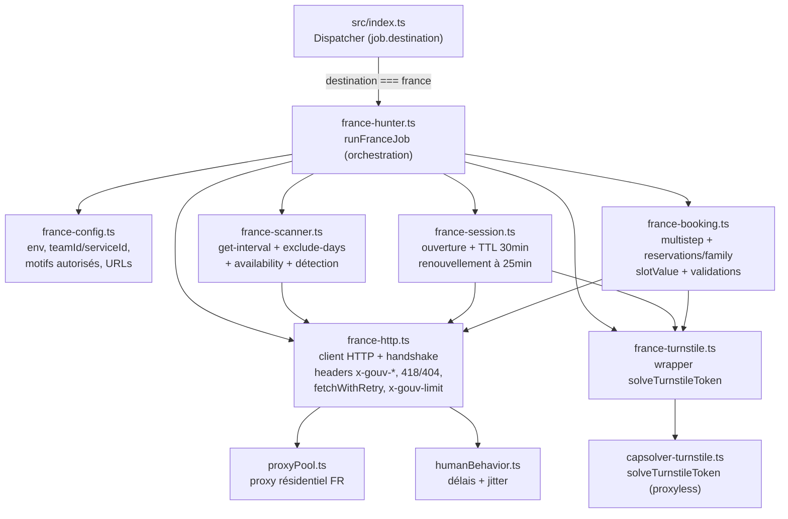
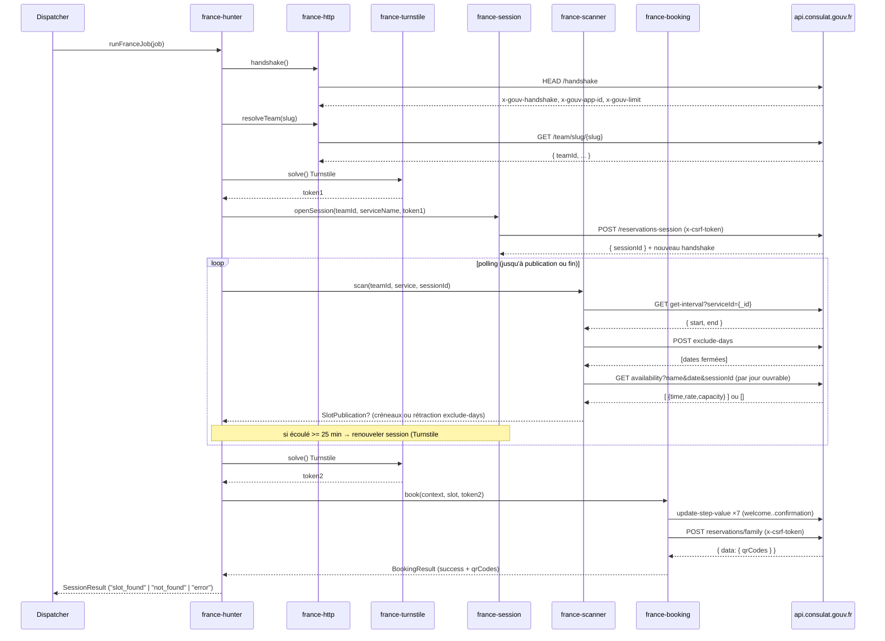

# Design Document

## Overview

Le **France Visa Hunter** est un nouveau module du monorepo VisaFlow (`artifacts/slot-hunter`) qui surveille et réserve automatiquement les créneaux de visas nationaux France sur le portail `consulat.gouv.fr` (solution white-label **Troov** pour le MEAE). Il rejoint les hunters existants (USA, Espagne, CEV/Canada, Suisse) et s'intègre au dispatcher central `src/index.ts` via le routage par `job.destination === "france"`.

Le design repose intégralement sur le reverse-engineering **validé en conditions réelles** documenté dans `bundle-analysis/france-bundle-2026-08-31.md` (source de vérité — sources maps publiques reconstruites + flux exécuté de bout en bout le 2026-08-31). Le portail n'a **pas de Cloudflare CDN** (nginx) mais impose un handshake anti-bot maison (HTTP 418 « teapot » sans bootstrap) et une protection Cloudflare **Turnstile** (2 résolutions par parcours), avec des sessions de réservation à TTL de 30 minutes.

### Stratégie générale

Le hunter reproduit fidèlement le flux du frontend légitime pour rester indétectable, en cinq phases :

1. **Bootstrap** — `HEAD /handshake` → récupération des jetons `x-gouv-handshake` (rejoué en `x-csrf-token`) et `x-gouv-app-id`. Sans handshake, toute requête renvoie HTTP 418.
2. **Résolution du consulat** — `GET /team/slug/{slug}` → `teamId` (jamais codé en dur).
3. **Ouverture de session** — résolution Turnstile #1 puis `POST /team/{teamId}/reservations-session` → `sessionId` (TTL 30 min).
4. **Scan optimal** — `get-interval` (fenêtre) + `exclude-days` (jours fermés) + `availability` (créneaux jour par jour, uniquement sur les jours ouvrables). Détection de publication.
5. **Booking multistep** — 7 étapes persistées via `update-step-value` (welcome → services → important-info → slots → contact → motif → confirmation), résolution Turnstile #2, puis `POST /team/{teamId}/reservations/family` → `data.qrCodes`.

### Principes de conception

- **HTTP pur** (undici/`fetch`), aucun Playwright : le portail n'a pas de challenge navigateur, seulement Turnstile résolu via CapSolver (proxyless, `src/capsolver-turnstile.ts`).
- **Réutilisation** : `solveTurnstileToken`, `proxyPool.ts`, `humanBehavior.ts`, patterns `fetchWithRetry` (timeout 30 s, `MAX_RETRIES=3`, backoff 2000 ms ×2).
- **Fonctions pures testables** : la logique de scan (calcul des jours scannables, `slotValue`, détection de publication, gestion du TTL) est isolée en fonctions pures sans effet réseau ni `Date.now()` implicite (le temps est injecté), à l'image du module `spain/spain-wallclock-grid.ts`.
- **TypeScript strict** : aucun `any`, types de retour explicites, `try/catch` contextuel autour de chaque appel réseau, logs préfixés `[franceHunter]`.

## Architecture

Le module vit dans `artifacts/slot-hunter/src/france/` (fichiers en kebab-case), avec les types dans `france-types.ts`. Le dispatcher `src/index.ts` route les Jobs `france` vers `runFranceJob`.

### Vue composants



### Flux d'exécution (séquence)



### Modules proposés (`src/france/`)

| Fichier | Responsabilité | Requirements couverts |
|---------|----------------|-----------------------|
| `france-config.ts` | Constantes (base API, sitekey Turnstile, `x-gouv-web`), lecture env (`.env`/dotenv), catalogue consulat/service, liste des motifs autorisés, timeouts/retries. | 3.1, 6.1, 8.4, 10.6, 12.1, 14.2 |
| `france-http.ts` | Client HTTP bas niveau : `fetchWithRetry` (timeout 30 s, 3 tentatives, backoff 2000 ms ×2), injection des headers `x-gouv-app-id` / `x-gouv-web` / `x-csrf-token`, gestion HTTP 418 (re-handshake), 404 `SESSION_ERROR` (remonté), `x-gouv-limit` (backoff), routage proxy. | 1.6–1.10, 8.5, 11.3–11.6, 12.2, 12.5 |
| `france-handshake.ts` | `handshake()` : `HEAD /handshake`, extraction/validation des jetons, retries. Résolution consulat `resolveTeam(slug)`. | 1.1–1.5, 1.8–1.10, 2.1–2.4 |
| `france-turnstile.ts` | Wrapper autour de `solveTurnstileToken` (proxyless, sitekey `0x4AAAAAAAc-bWzy0zJTmAqs`), retries + backoff, garantie « 1 token session distinct + 1 token booking distinct ». | 3.1–3.4 |
| `france-session.ts` | `openSession()`, suivi TTL (30 min), renouvellement anticipé à 25 min avec chevauchement, mise à jour `x-csrf-token` depuis la réponse, détection expiration (`SESSION_ERROR`). | 4.1–4.6, 5.1–5.5 |
| `france-scanner.ts` | `getInterval()`, `getExcludeDays()`, `computeScannableDays()` (pure), `scanAvailability()` (par jour), détection de `Slot_Publication`, polling avec jitter. | 6.1–6.4, 7.1–7.5, 8.1–8.5, 9.1–9.4 |
| `france-booking.ts` | `computeSlotValue()` (pure), validation contact/motif (pures), persistance des 7 étapes, construction `reservations`, `POST reservations/family`, validation `data.qrCodes`. | 10.1–10.12 |
| `france-hunter.ts` | Orchestration `runFranceJob(job): Promise<SessionResult>`, câblage dispatcher, isolation par Job. | 13.1–13.3, 14.1–14.3 |
| `france-types.ts` | Interfaces TypeScript (Job France, config, DTOs, résultats). | transversal |

## Components and Interfaces

### `france-config.ts`

Centralise les constantes et la lecture d'environnement. Aucune valeur secrète en dur (Requirement 12.1).

```typescript
export const FRANCE_API_BASE = "https://api.consulat.gouv.fr/api";
export const FRANCE_TURNSTILE_SITEKEY = "0x4AAAAAAAc-bWzy0zJTmAqs";
export const FRANCE_GOUV_WEB = "fr.gouv.consulat";

export const FRANCE_TIMEOUT_MS = 30_000;
export const FRANCE_MAX_RETRIES = 3;
export const FRANCE_RETRY_BACKOFF_MS = 2_000;

export const FRANCE_SESSION_TTL_MS = 30 * 60_000;    // 30 min
export const FRANCE_SESSION_RENEW_MS = 25 * 60_000;  // renouvellement anticipé

/** Motifs autorisés pour le custom field Visas (key 54cfd964c63f3386). */
export const FRANCE_MOTIF_KEY = "54cfd964c63f3386";
export const FRANCE_ALLOWED_MOTIFS = [
  "Regroupement familial",
  "Visa retour",
  "Reunification familial",
  "Stagiaire associé",
  "Conjoint de Français - Installation",
  "Etudiant",
  "Autres",
] as const;
export type FranceMotif = (typeof FRANCE_ALLOWED_MOTIFS)[number];

/** Clés API lues depuis l'environnement (jamais en dur). */
export function loadFranceEnv(): FranceEnvConfig;
```

### `france-http.ts`

Client HTTP transverse. Maintient l'état d'authentification courant (jetons handshake) et applique toutes les règles réseau.

```typescript
/** État d'authentification anti-bot courant (mutable, par Job). */
export interface FranceAuthState {
  handshakeToken: string;   // = x-csrf-token courant
  appId: string;            // x-gouv-app-id
  rateLimit?: string;       // dernier x-gouv-limit observé
}

export interface FranceHttpClient {
  /** GET avec headers x-gouv-* injectés, fetchWithRetry, gestion 418/404/x-gouv-limit. */
  get<T>(path: string, opts?: FranceRequestOptions): Promise<FranceHttpResult<T>>;
  /** POST/PUT sensibles : inclut x-csrf-token. */
  post<T>(path: string, body: unknown, opts?: FranceRequestOptions): Promise<FranceHttpResult<T>>;
  head(path: string, opts?: FranceRequestOptions): Promise<FranceHttpHeadResult>;
  /** Met à jour le x-csrf-token courant (réponse de session). */
  updateCsrf(token: string): void;
  authState(): Readonly<FranceAuthState>;
}

/** Résultat normalisé d'une requête. `sessionError` = HTTP 404 SESSION_ERROR. */
export interface FranceHttpResult<T> {
  status: number;
  ok: boolean;
  body: T | null;
  sessionError: boolean;   // true si 404 { message: "SESSION_ERROR" }
  teapot: boolean;         // true si 418 (handshake absent/invalide)
}

/** Fabrique le client lié à un proxy + auth state donnés. */
export function createFranceHttpClient(
  auth: FranceAuthState,
  proxyUrl: string,
  onRehandshake: () => Promise<FranceAuthState | null>,
): FranceHttpClient;
```

Comportement clé (Requirements 1.6–1.10, 8.5, 11.3–11.6, 12.5) :
- Chaque requête inclut `x-gouv-app-id` et `x-gouv-web: fr.gouv.consulat` ; les POST/PUT incluent `x-csrf-token`.
- HTTP **418** → invoque `onRehandshake()` puis rejoue la requête d'origine, max 3 handshakes.
- HTTP **404 + `SESSION_ERROR`** → renvoyé via `sessionError: true` (traité par `france-session`).
- `x-gouv-limit` indiquant une limite atteinte → backoff exponentiel (base 2000 ms) avant la requête suivante, max 3 tentatives.
- Timeout 30 s via `AbortController` ; retry sur erreur réseau ou statut ≥ 500 ; pas de retry sur 4xx (hors 418).

### `france-handshake.ts`

```typescript
/** HEAD /handshake → jetons anti-bot. null si échec après 3 tentatives. */
export async function performHandshake(
  proxyUrl: string,
): Promise<FranceAuthState | null>;

/** GET /team/slug/{slug} → teamId validé. null si absent/invalide. */
export async function resolveTeam(
  http: FranceHttpClient,
  slug: string,
): Promise<{ teamId: string } | null>;
```

### `france-turnstile.ts`

```typescript
export type TurnstilePurpose = "session" | "booking";

/**
 * Résout un token Turnstile via solveTurnstileToken (proxyless).
 * Retries 3× avec backoff 2000 ms ×2. Retourne null si échec.
 */
export async function solveFranceTurnstile(
  purpose: TurnstilePurpose,
  apiKey: string,
): Promise<string | null>;
```

Contrat (Requirement 3.3) : deux appels distincts — un `"session"` pour l'ouverture, un `"booking"` pour la finalisation — produisent deux tokens distincts (pas de réutilisation).

### `france-session.ts`

```typescript
export interface ReservationSession {
  sessionId: string;
  openedAtMs: number;      // horodatage d'ouverture (temps injecté)
  ttlMs: number;           // 30 * 60_000
}

/** POST /reservations-session avec Turnstile #1. null si échec après 3 tentatives. */
export async function openSession(
  http: FranceHttpClient,
  teamId: string,
  standaloneServiceName: string,
  turnstileToken: string,
  nowMs: number,
): Promise<ReservationSession | null>;

/** Pure : true si la session doit être renouvelée (écoulé >= 25 min). */
export function shouldRenewSession(session: ReservationSession, nowMs: number): boolean;

/** Pure : true si la session est expirée (écoulé >= 30 min). */
export function isSessionExpired(session: ReservationSession, nowMs: number): boolean;
```

Le renouvellement (Requirement 5.2) ouvre une **nouvelle** session (nouveau Turnstile #1) tout en gardant l'actuelle vivante jusqu'à confirmation, puis bascule le `sessionId` sans perdre le contexte de scan (Scan_Window, Excluded_Days courants — Requirement 5.4).

### `france-scanner.ts`

```typescript
export interface ScanWindow {
  start: string;  // "YYYY-MM-DD"
  end: string;    // "YYYY-MM-DD" (>= start)
}

/** GET get-interval?serviceId={_id}. null si invalide. */
export async function getInterval(
  http: FranceHttpClient, teamId: string, serviceId: string,
): Promise<ScanWindow | null>;

/** POST exclude-days → set de dates fermées. null si invalide (hors SESSION_ERROR). */
export async function getExcludeDays(
  http: FranceHttpClient, teamId: string, serviceId: string, sessionId: string,
): Promise<Set<string> | null>;

/** Pure : dates ∈ [start,end] et ∉ excludeDays, triées croissant. */
export function computeScannableDays(window: ScanWindow, excludeDays: ReadonlySet<string>): string[];

/** GET availability pour un jour. Renvoie [] si agenda vide (HTTP 200, cas normal). */
export async function scanAvailabilityForDay(
  http: FranceHttpClient, teamId: string, serviceName: string,
  date: string, sessionId: string,
): Promise<FranceSlot[] | null>;

/** Pure : détection de publication entre deux scans. */
export function detectPublication(
  prevExcluded: ReadonlySet<string>,
  currExcluded: ReadonlySet<string>,
  window: ScanWindow,
  daySlots: ReadonlyMap<string, FranceSlot[]>,
): SlotPublication | null;
```

`detectPublication` signale (Requirement 9.1, 9.2) : (a) au moins un jour avec `daySlots` non vide, ou (b) rétraction de `excludeDays` révélant ≥ 1 jour ouvrable supplémentaire dans la fenêtre. Le polling applique un jitter ±20 % (Requirement 9.4) via `humanBehavior.ts`.

### `france-booking.ts`

```typescript
/** Pure : slotValue = slugify("slot-" + name + "-" + ISO + "-" + time).toLowerCase(). */
export function computeSlotValue(serviceName: string, slotDateIso: string, time: string): string;

/** Pure : valide les bornes du contact (Requirement 10.4). */
export function validateContact(contact: BookingContact): ValidationResult;

/** Pure : valide que motif ∈ FRANCE_ALLOWED_MOTIFS (Requirement 10.6/10.7). */
export function validateMotif(motif: string): motif is FranceMotif;

/** Persiste les 7 étapes puis POST reservations/family. */
export async function runBookingFlow(
  http: FranceHttpClient, ctx: BookingContext,
): Promise<BookingResult>;
```

### `france-hunter.ts`

```typescript
import type { HunterJob } from "../convexClient.js";
import type { SessionResult } from "../usaPortal/types.js";

/** Point d'entrée dispatcher. Isolation totale par Job (Requirement 14.3). */
export async function runFranceJob(job: HunterJob): Promise<SessionResult>;
```

Intégration dispatcher dans `src/index.ts` (Requirement 13.1) :

```typescript
} else if (due.destination === "france") {
  result = await runFranceJob(due);
}
```

## Data Models

### Job France (extension `HunterJob`)

Les champs France sont portés par la config du Job (slug consulat, service cible, contact, motif) sans identifiant codé en dur (Requirements 14.1, 14.2).

```typescript
export interface FranceServiceTarget {
  serviceId: string;    // _id, pour get-interval
  serviceName: string;  // nom textuel complet, pour availability + slotValue
}

export interface FranceJobConfig {
  consulateSlug: string;         // ex. "ambassade-de-france-a-kinshasa"
  service: FranceServiceTarget;  // ex. Visas: id 6346..f52, name "Visas"
  contact: BookingContact;
  motif: FranceMotif;
  autoBook: boolean;
  scanIntervalMs: number;        // intervalle de polling (jitter ±20 % appliqué)
}
```

### DTOs API (source : france-bundle-2026-08-31.md)

```typescript
/** Créneau — GET /reservations/availability. */
export interface FranceSlot {
  time: string;      // "HH:MM"
  rate: string;      // "0.00" (chaîne décimale à 2 décimales)
  capacity: number;  // entier positif
}

/** GET /reservations/get-interval. */
export interface GetIntervalResponse {
  start: string;  // "YYYY-MM-DD"
  end: string;    // "YYYY-MM-DD"
}

/** POST /reservations/exclude-days → tableau de "YYYY-MM-DD". */
export type ExcludeDaysResponse = string[];

/** Body POST /reservations/exclude-days. */
export interface ExcludeDaysBody {
  session: Record<string, true>;  // { [serviceId]: true }
  sessionId: string;
}

/** Contact principal (mois birthdate 0-indexé, convention dayjs). */
export interface BookingContact {
  firstname: string;   // 1..100
  lastname: string;    // 1..100
  email: string;       // contient @ + domaine
  mobile: string;      // 6..20
  birthdate: { month: number; day: number; year: number }; // month ∈ [0,11]
}

/** Custom field Motif. */
export interface CustomField { key: string; values: string[]; }

/** Slot conservé pour le booking. */
export interface SlotToKeep {
  slotValue: string;                 // slugifié
  date: string;                      // "YYYY-MM-DDTHH:MM:00"
  time: string;                      // "HH:MM"
  serviceName: string;
}

export interface ServiceForApi {
  customFields: CustomField[];
  slotsToKeep: SlotToKeep[];
}

export interface UserForApi extends BookingContact {
  services: ServiceForApi[];
}

/** Body POST /team/{teamId}/reservations/family. */
export interface ReservationsFamilyBody {
  reservations: {
    mainUser: UserForApi;
    secondaryUsers: UserForApi[];  // [] pour Visas (reservation_people_max = 1)
    sessionId: string;
    team: string;                  // teamId
  };
  language: "fr";
  captcha: string;                 // Turnstile #2
  sessionId: string;
}

/** Réponse booking. */
export interface ReservationsFamilyResponse {
  data: { qrCodes: unknown[] };
}
```

### Résultat & états

```typescript
export interface SlotPublication {
  reason: "availability" | "exclude_days_retraction";
  day: string;                 // "YYYY-MM-DD"
  slots: FranceSlot[];
}

export interface BookingResult {
  success: boolean;
  qrCodes?: unknown[];
  failedStep?: string;         // stepType ayant échoué
  failedStepIndex?: number;
  error?: string;
}

export interface ValidationResult {
  valid: boolean;
  invalidField?: string;       // nom du champ hors bornes
}
```

Le point d'entrée `runFranceJob` renvoie le type commun `SessionResult` (`"slot_found" | "not_found" | "error" | ...`) pour rester conforme aux autres hunters (Requirement 13.2, 13.3).

## Correctness Properties

*Une propriété est une caractéristique ou un comportement qui doit rester vrai pour toutes les exécutions valides du système — un énoncé formel de ce que le système doit faire. Les propriétés font le pont entre les spécifications lisibles par l'humain et les garanties de correction vérifiables par la machine.*

Chaque propriété ci-dessous est universellement quantifiée et destinée à être vérifiée par un test property-based (fast-check + vitest, ≥ 100 itérations). Les propriétés portent sur les fonctions **pures** du module (parsing, validation, calcul de fenêtre, `slotValue`, détection, bornes) ; les comportements réseau/effets de bord sont couverts par des tests d'intégration/exemples (voir Testing Strategy).

### Property 1: Parse du handshake extrait les deux jetons

*Pour tout* jeu de headers de réponse contenant `x-gouv-handshake` et `x-gouv-app-id` non vides, `parseHandshakeHeaders` produit un `FranceAuthState` dont `handshakeToken` égale `x-gouv-handshake` et `appId` égale `x-gouv-app-id`.

**Validates: Requirements 1.2, 1.4**

### Property 2: Validité du handshake ssi les deux jetons sont non vides

*Pour tout* jeu de headers, `isHandshakeValid` retourne `true` si et seulement si `x-gouv-handshake` et `x-gouv-app-id` sont tous deux présents et non vides (chaîne blanche exclue).

**Validates: Requirements 1.3, 1.5**

### Property 3: Backoff exponentiel déterministe

*Pour tout* numéro de tentative `attempt ≥ 0`, le délai de backoff calculé égale `2000 * 2^attempt` millisecondes.

**Validates: Requirements 1.10, 4.5, 5.5, 11.5, 11.6**

### Property 4: Headers anti-bot toujours présents

*Pour tout* `FranceAuthState` valide et toute requête construite, les headers émis contiennent `x-gouv-app-id` (égal à `authState.appId`) et `x-gouv-web` égal à `fr.gouv.consulat`.

**Validates: Requirements 1.6**

### Property 5: x-csrf-token sur les requêtes POST/PUT

*Pour toute* requête de méthode POST ou PUT construite avec un `FranceAuthState`, les headers émis contiennent `x-csrf-token` égal au `handshakeToken` courant.

**Validates: Requirements 1.7**

### Property 6: Validation du teamId

*Pour tout* corps de réponse de résolution de consulat, `isValidTeamId` retourne `true` si et seulement si le champ `teamId` est une chaîne non vide.

**Validates: Requirements 2.2**

### Property 7: Le token Turnstile est placé dans le champ captcha

*Pour tout* token Turnstile non vide, le corps de requête construit pour l'ouverture de session porte ce token exactement dans le champ `captcha`.

**Validates: Requirements 3.2**

### Property 8: Deux tokens Turnstile distincts par parcours

*Pour tout* parcours complet (ouverture de session puis booking), exactement un token de type `session` et exactement un token de type `booking` sont résolus, et ces deux tokens sont distincts (aucune réutilisation).

**Validates: Requirements 3.3**

### Property 9: Validation du sessionId

*Pour tout* corps de réponse d'ouverture de session, `isValidSessionId` retourne `true` si et seulement si le champ `sessionId` est une chaîne non vide.

**Validates: Requirements 4.2**

### Property 10: Mise à jour du x-csrf-token depuis la réponse de session

*Pour toute* réponse de session contenant une nouvelle valeur de handshake, après `updateCsrf` le `x-csrf-token` courant du client égale cette nouvelle valeur.

**Validates: Requirements 4.3**

### Property 11: Expiration de session à 30 minutes exactement

*Pour toute* `ReservationSession` et tout instant `nowMs`, `isSessionExpired` retourne `true` si et seulement si `nowMs - session.openedAtMs ≥ 30 minutes`.

**Validates: Requirements 4.4, 5.1**

### Property 12: Renouvellement anticipé à 25 minutes

*Pour toute* `ReservationSession` et tout instant `nowMs`, `shouldRenewSession` retourne `true` si et seulement si `nowMs - session.openedAtMs ≥ 25 minutes`.

**Validates: Requirements 5.2**

### Property 13: Validation de la fenêtre de scan

*Pour tout* objet `{start, end}`, `isValidWindow` retourne `true` si et seulement si `start` et `end` sont au format `YYYY-MM-DD` et `start ≤ end` (comparaison lexicographique équivalente à chronologique pour ce format).

**Validates: Requirements 6.2**

### Property 14: Jours scannables strictement dans la fenêtre et hors jours exclus

*Pour toute* `ScanWindow` valide et tout ensemble `Excluded_Days`, chaque jour retourné par `computeScannableDays` appartient à l'intervalle inclusif `[start, end]` **et** n'appartient pas à `Excluded_Days` ; réciproquement, tout jour de `[start, end]` absent de `Excluded_Days` est présent dans le résultat.

**Validates: Requirements 6.3, 7.4**

### Property 15: Parse des jours exclus ne conserve que des dates valides

*Pour tout* tableau de valeurs, `parseExcludeDays` produit un ensemble dont tous les éléments sont des dates au format `YYYY-MM-DD`, et n'inclut aucune valeur du tableau d'entrée qui n'est pas une date valide.

**Validates: Requirements 7.2, 7.3**

### Property 16: Parse des créneaux préserve les slots valides

*Pour tout* tableau de créneaux bruts conformes au DTO, `parseSlots` produit la même liste de `FranceSlot` typés `{time, rate, capacity}` (round-trip de structure), où `time` respecte `HH:MM`, `rate` est une chaîne décimale à deux décimales et `capacity` est un entier positif.

**Validates: Requirements 8.2**

### Property 17: Séparation stricte identifiant `_id` / nom textuel

*Pour tout* service `{serviceId, serviceName}` distincts, l'URL construite pour `get-interval` contient `serviceId` (et jamais `serviceName`), et l'URL construite pour `availability` contient `serviceName` dans le paramètre `name` (et jamais `serviceId`).

**Validates: Requirements 8.4, 14.2**

### Property 18: Un jour en erreur n'interrompt pas le scan global

*Pour toute* liste de jours scannables dont un sous-ensemble arbitraire produit une erreur (statut ≠ 200 hors `SESSION_ERROR` ou DTO non conforme), le scanner produit un résultat pour chacun des jours restants (aucun jour valide n'est omis à cause d'un jour en erreur).

**Validates: Requirements 8.5**

### Property 19: Publication signalée sur créneaux disponibles

*Pour toute* carte `jour → créneaux` contenant au moins un jour avec au moins un `FranceSlot`, `detectPublication` signale une `Slot_Publication` dont le jour et les slots correspondent à ce jour.

**Validates: Requirements 9.1**

### Property 20: Publication signalée sur rétraction des jours exclus

*Pour tout* couple d'ensembles `(prevExcluded, currExcluded)` et toute `ScanWindow`, si `currExcluded` retire au moins un jour appartenant à la fenêtre qui était dans `prevExcluded`, alors `detectPublication` signale une `Slot_Publication` de raison `exclude_days_retraction`.

**Validates: Requirements 9.2**

### Property 21: Intervalle de polling borné par le jitter

*Pour tout* intervalle de base `base > 0`, l'intervalle de polling effectif calculé avec jitter ±20 % appartient à `[base × 0.8, base × 1.2]`.

**Validates: Requirements 9.4**

### Property 22: Ordre des étapes et stepIndex du parcours Visas

*Pour tout* parcours de booking Visas, la séquence des `stepType` persistés égale exactement `[welcome, services, important-info, slots, contact, motif, confirmation]` et chaque étape porte un `stepIndex` égal à sa position (0 à 6).

**Validates: Requirements 10.2**

### Property 23: Validation des bornes du contact

*Pour tout* `BookingContact`, `validateContact` retourne `valid = true` si et seulement si : `firstname` et `lastname` ont une longueur dans `[1, 100]`, `email` contient un `@` suivi d'un domaine, `mobile` a une longueur dans `[6, 20]`, `birthdate.month ∈ [0, 11]`, `birthdate.day ∈ [1, 31]` et `birthdate.year ∈ [1900, année courante]`.

**Validates: Requirements 10.4**

### Property 24: Validation du motif par appartenance à la liste

*Pour toute* chaîne `motif`, `validateMotif` retourne `true` si et seulement si `motif` appartient exactement à `FRANCE_ALLOWED_MOTIFS`.

**Validates: Requirements 10.6**

### Property 25: slotValue déterministe et en minuscules

*Pour tout* triplet `(serviceName, ISOdate, time)`, `computeSlotValue` est déterministe (mêmes entrées → même sortie), sa sortie est entièrement en minuscules, et le `SlotToKeep` construit porte ce `slotValue`, la `date` au format `YYYY-MM-DDTHH:MM:00`, le `time` et le `serviceName` fournis.

**Validates: Requirements 10.8**

### Property 26: Structure des reservations bien formée pour Visas

*Pour tout* `BookingContext` Visas, `buildReservations` produit `{mainUser, secondaryUsers, sessionId, team}` où `secondaryUsers` est un tableau vide, `team` égale le `teamId` du Job, et `mainUser.services[0]` contient à la fois `customFields` (avec la clé motif) et `slotsToKeep`.

**Validates: Requirements 10.10**

### Property 27: Succès du booking conditionné à qrCodes non vide

*Pour toute* réponse de `reservations/family`, `interpretBookingResponse` retourne `success = true` si et seulement si `data.qrCodes` est présent et non vide.

**Validates: Requirements 10.11**

### Property 28: User-Agent cohérent sur toute la session

*Pour toute* session et toute suite de requêtes émises pendant cette session, le header `User-Agent` est identique pour toutes les requêtes.

**Validates: Requirements 11.1**

### Property 29: Délai inter-requêtes borné

*Pour tout* enchaînement de deux requêtes, le délai inséré appartient à `[1500 ms, 2500 ms]` (base 2000 ms, jitter ±500 ms).

**Validates: Requirements 11.2**

### Property 30: Masquage des données sensibles

*Pour toute* valeur sensible (token, clé, cookie, `x-csrf-token`, PII), la forme journalisée par `maskSecret` ne révèle jamais plus que les 8 premiers caractères (suivis de `...`), ou uniquement le nom de la clé.

**Validates: Requirements 12.4**

### Property 31: Validation défensive des réponses externes

*Pour toute* réponse d'API externe non conforme au DTO attendu (champ manquant ou type incorrect), le validateur correspondant rejette la réponse (retour `null`/`invalid`) et ne propage aucune donnée non validée en aval.

**Validates: Requirements 12.2**

### Property 32: Isolation des Jobs

*Pour tout* couple de Jobs distincts traités par le hunter, leurs contextes ne partagent jamais le même `sessionId`, la même valeur `x-csrf-token`, ni la même IP proxy.

**Validates: Requirements 14.3**

## Error Handling

La gestion d'erreurs suit les patterns du projet (règle 05 : `fetchWithRetry`, timeout 30 s, `MAX_RETRIES=3`, backoff 2000 ms ×2) et les règles de logging (règle 01 : préfixe `[franceHunter]`, aucun secret en clair).

| Condition | Détection | Réaction | Requirements |
|-----------|-----------|----------|--------------|
| **HTTP 418 « teapot »** | `res.status === 418` | Considérer le handshake absent/invalide → `performHandshake()` puis rejouer la requête d'origine, max 3 handshakes. | 1.8 |
| **Handshake échoué (jeton absent/vide)** | `isHandshakeValid === false` | Retry avec backoff exponentiel (base 2000 ms), max 3. Après échec : log `[franceHunter]` + contexte Job, abandon, état Job inchangé. | 1.3, 1.5, 1.9, 1.10 |
| **Consulat introuvable** | `teamId` absent/vide ou statut ≥ 400 | Log `[franceHunter]` + slug, abandon du Job, état inchangé. | 2.3 |
| **Turnstile non résolu** | `solveTurnstileToken` renvoie `null` | Retry backoff, max 3. Après échec : log + contexte étape, abandon de l'étape, session inchangée. | 3.4 |
| **Ouverture de session KO** | `sessionId` invalide ou statut ≥ 400 | Retry backoff, max 3. Après 3 échecs : log + abandon Job, état inchangé. | 4.5, 4.6 |
| **404 `SESSION_ERROR`** | `res.status === 404 && body.message === "SESSION_ERROR"` | Session expirée → re-bootstrap complet (handshake + Turnstile #1 + session), max 3. Échec → log + abandon Job. Le contexte de scan (window, excludeDays) est préservé. | 5.3, 5.4, 5.5 |
| **get-interval invalide** | `start`/`end` absents, format KO, `start > end`, statut ≥ 400 | Log `[franceHunter]` + cause, interruption du scan courant, session inchangée. | 6.4 |
| **exclude-days invalide** | réponse non-tableau ou dates invalides, statut ≥ 400 (hors 404 `SESSION_ERROR`) | Log + interruption du scan, session inchangée. | 7.5 |
| **availability : agenda vide** | HTTP 200 + `[]` | **Cas normal**, jamais une erreur : jour sans créneau. Le scan continue. | 8.3 |
| **availability : erreur d'un jour** | statut ≠ 200 (hors `SESSION_ERROR`) ou DTO non conforme après 3 tentatives | Log `[franceHunter]` + jour concerné, **poursuivre** le scan des jours restants. | 8.5 |
| **Étape de booking en erreur** | statut ≥ 400 ou échec après 3 tentatives | Interrompre le Booking_Flow **sans** `reservations/family`, log étape + `stepIndex`. | 10.3 |
| **Champ contact invalide** | `validateContact.valid === false` | Interrompre le booking sans envoi final, log champ invalide. | 10.5 |
| **Motif hors liste** | `validateMotif === false` | Interrompre le booking sans envoi final, log motif rejeté. | 10.7 |
| **Booking final échoué** | `data.qrCodes` absent/vide, ou erreur POST | Log contexte + résultat, **préserver** la session, **aucune** nouvelle tentative automatique de réservation finale. | 10.11, 10.12 |
| **Rate limit `x-gouv-limit`** | header indiquant la limite atteinte | Backoff exponentiel (base 2000 ms), max 3, avant la requête suivante. | 11.5 |
| **Réponse externe malformée** | validateur DTO échoue | Rejeter la réponse, log `[franceHunter]`, ne propager aucune donnée non validée. | 12.2 |
| **Exception réseau** | `try/catch` autour de chaque appel | Message d'erreur contextuel préfixé `[franceHunter]`, re-throw ou remontée selon l'appelant. | 12.5 |

Notes de conception :
- Le **418** et le **404 `SESSION_ERROR`** sont les deux signaux de récupération majeurs, gérés à des niveaux distincts (`france-http` pour le 418/re-handshake ; `france-session` pour le `SESSION_ERROR`/re-bootstrap) pour éviter les boucles croisées.
- Le compteur de tentatives de handshake est **borné indépendamment** des retries réseau applicatifs afin de respecter le plafond de 3 handshakes (Requirement 1.8).
- Tout abandon de Job **préserve l'état du Job** (aucune mutation Convex de statut) pour permettre une reprise ultérieure.

## Testing Strategy

Le module est particulièrement adapté au **property-based testing** : sa logique cœur (calcul des jours scannables, `slotValue`, validations, détection de publication, gestion du TTL, parsing des DTOs) est constituée de **fonctions pures** avec des propriétés universelles sur un large espace d'entrées. Les effets réseau et l'orchestration sont couverts par des tests d'intégration à base de mocks et quelques exemples ciblés.

### Approche duale

- **Tests unitaires (exemples / edge cases)** : comportements d'erreur ciblés (abandon de Job, interruption de booking), séquencement d'orchestration, cas limites (`[]` agenda vide, réponse `SESSION_ERROR`), câblage dispatcher.
- **Tests property-based** : les 32 propriétés ci-dessus, chacune implémentée par **un seul** test property-based.

### Outillage

- **Runner** : `vitest` (déjà utilisé dans `artifacts/slot-hunter/src/__tests__/`).
- **Property-based** : `fast-check` (bibliothèque standard TypeScript ; ne pas réimplémenter le PBT à la main).
- **Mocks réseau** : `vi.mock` sur `france-http` / `solveTurnstileToken` pour isoler la logique des effets de bord ; les fonctions pures (scanner, booking helpers, session TTL) sont testées **sans** mock.
- **Injection du temps** : `nowMs` est un paramètre explicite des fonctions de session/polling (comme `spain-wallclock-grid.ts`) → tests déterministes sans horloge réelle.

### Configuration des tests property-based

- **Minimum 100 itérations** par propriété (`fc.assert(fc.property(...), { numRuns: 100 })`).
- Chaque test référence sa propriété de design via un commentaire au format :
  `// Feature: france-visa-hunter, Property {n}: {texte de la propriété}`.
- Générateurs dédiés : dates `YYYY-MM-DD` valides/invalides, fenêtres `{start,end}`, ensembles de jours exclus (sous-ensembles/sur-ensembles), contacts (dans/hors bornes), motifs (liste + hors liste), slots `{time,rate,capacity}`, headers handshake (présents/absents/vides).

### Répartition property vs intégration/exemple

| Type | Cible | Exemples de critères |
|------|-------|----------------------|
| PROPERTY | fonctions pures | 1.2/1.4 (parse), 6.3/7.4 (scannable), 8.4/14.2 (id/name), 9.1/9.2 (détection), 10.4 (contact), 10.6 (motif), 10.8 (slotValue), 11.2 (jitter), 12.4 (masquage), 14.3 (isolation) |
| INTEGRATION (mocks) | appels API + retries | 1.1/1.8 (handshake/418), 2.1 (resolveTeam), 4.1 (session), 5.3 (SESSION_ERROR), 6.1/7.1/8.1 (scan endpoints), 10.1/10.9 (booking POST), 11.3/11.6 (proxy/timeout) |
| EXAMPLE | comportements d'erreur & câblage | 1.9, 2.3, 4.6, 5.4, 6.4, 8.3, 10.3/10.5/10.7/10.12, 12.3/12.5, 13.1/13.2 |
| SMOKE | config / typage | 12.1 (aucun secret en dur), 13.3 (`tsc --noEmit`, pas de `any`) |

### Harnais live (optionnel, hors CI)

Un script de validation live réutilise la référence `france-live-scan.mjs` (flux handshake → Turnstile → session → get-interval → exclude-days → availability). **Banc de test** : le service **ADF** de Kinshasa (`6346e242c47b29722d5f5f4e`), qui **a des créneaux** en conditions réelles, sert à valider le flux de scan de bout en bout ; le service **Visas** cible retourne `[]` (agenda vide normal) tant qu'aucune publication n'a lieu.

> **Aucun booking réel n'est exécuté en test.** Le flux `reservations/family` est validé uniquement par mocks (structure du body, `x-csrf-token`, interprétation `qrCodes`). Le harnais live s'arrête avant `reservations/family` pour ne jamais créer de rendez-vous involontaire, conformément aux contraintes du projet (limites de rate, indétectabilité, tests avec compte réel avant commit uniquement pour le scan).

### Anti-détection (validation)

- **UA cohérent** (Property 28) et **délai inter-requêtes borné** (Property 29) sont testés en property-based sur les helpers `humanBehavior`.
- Le **routage proxy résidentiel FR** et la **timezone `Europe/Paris`** (Requirements 11.3, 11.4) sont validés par tests d'intégration vérifiant le proxy sélectionné et la stabilité de l'IP au sein d'une session (changement uniquement entre sessions ou après blocage).
- Le **jitter de polling ±20 %** (Property 21) et le **backoff sur `x-gouv-limit`** (Property 3) garantissent l'absence de patterns réguliers détectables.
