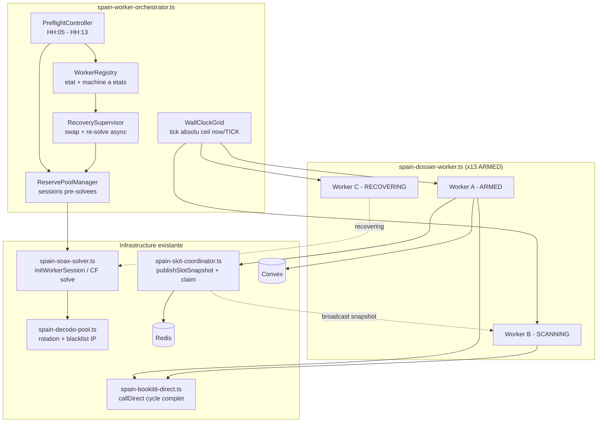
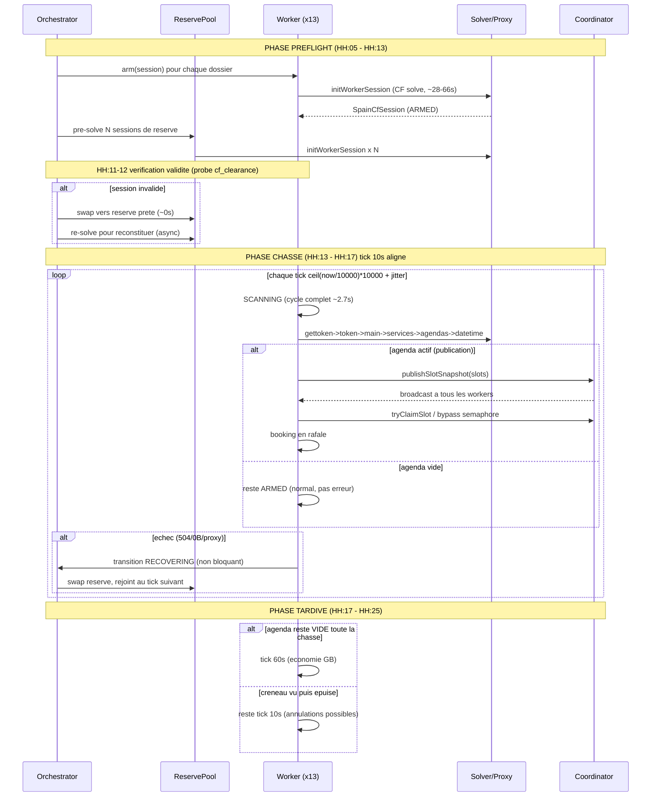
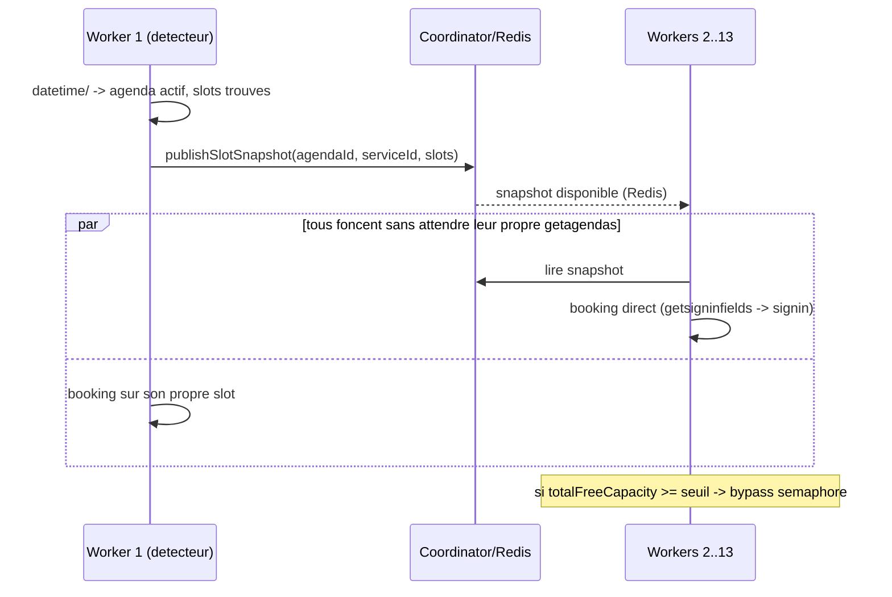

# Design Document: spain-synchronized-scan

## Overview

Le worker Espagne (Bookitit / CitaConsular) lance aujourd'hui ~13 workers « parallèles mais NON synchronisés ». Chaque worker exécute `scan → sleep(relatif) → scan`, ce qui provoque une **dérive de phase** : à l'instant exact de publication des créneaux, les workers sont dispersés sur une plage de -11 s à -43 s depuis leur dernier scan. Comme les créneaux ne durent que ~60 s, cette dispersion transforme la détection en loterie. Forensic prouvé le 2026-08-31 : sur 12 workers TOUS sains (0 erreur avant publication), seuls 4 ont vu les créneaux et 3 ont booké.

Cette feature transforme les workers en un **essaim synchronisé sur une grille d'horloge murale absolue** : chaque worker dort jusqu'au prochain tick `ceil(now/TICK)*TICK` au lieu d'un sleep relatif. L'horloge devient une barrière commune sans coordination centrale — tous les workers finissent leur cycle et regardent `datetime/` dans la même fenêtre de tick, donc détectent la publication quasi simultanément et bookent en rafale. On y ajoute : une **phase preflight** (HH:05→HH:13) qui pré-arme les sessions et maintient un **pool de sessions de réserve** pré-solvées (swap instantané en cas de mort proxy, car réparer = re-solve ~28-66 s), une **machine à états worker** (ARMED / SCANNING / RECOVERING) avec récupération asynchrone non bloquante, un **tri strict des échecs**, un **mode RACE** découplant booking de détection via `publishSlotSnapshot` déjà existant, et un **ralentissement tardif** (HH:17→HH:25, tick 60 s) si aucun créneau n'a jamais été vu.

Contrainte physique incontournable prouvée : le portail Bookitit exige un cycle complet `gettoken → POST token → main → getservices → getagendas → datetime` avec un **PHPSESSID neuf à chaque scan** (`getagendas/` = 1 seule fois par PHPSESSID, règle §9). On ne peut donc PAS scanner plus vite qu'un cycle complet (~2.7 s sans créneau). Le TICK = 10 s n'accélère pas la fréquence ; il **aligne les workers** pour que le MAX d'entre eux voie l'instant T. La grille alignée introduit un pattern régulier détectable — le design prévoit un **jitter par worker (±20 %)** pour rester indétectable tout en restant globalement aligné.

## Architecture



**Rôle des composants :**

- **WallClockGrid** — Fonction pure qui calcule le prochain front de tick absolu. Remplace le `sleep(wait)` relatif dans la boucle `while (Date.now() < windowEnd)` du worker. Déjà partiellement présente (`adaptiveInterval - (nowMs % adaptiveInterval)`) mais sans phases explicites ni jitter.
- **PreflightController** — Nouvelle logique dans l'orchestrateur : pendant HH:05→HH:13, arme les 13 sessions et vérifie leur validité (~HH:11-12) avant la phase de chasse.
- **ReservePoolManager** — Nouveau : maintient N sessions de réserve pré-solvées (chacune sur sa propre IP). Dimensionnement configurable (`SPAIN_RESERVE_POOL_SIZE`).
- **RecoverySupervisor** — Fait passer un worker mort en RECOVERING, swap immédiat vers une réserve (~0 s), puis reconstitue la réserve par re-solve en tâche de fond.
- **WorkerRegistry** — Étend la `Map<string, RunningWorker>` existante avec l'état de la machine à états et la phase courante.

## Sequence Diagrams

### Séquence temporelle globale : preflight → chasse → tardif



### Séquence : détection découplée du booking (mode RACE)



## Components and Interfaces

### Component 1: WallClockGrid

**Purpose** : Calculer le prochain front de tick absolu aligné sur l'horloge murale, avec jitter par worker pour l'indétectabilité, et sélectionner le tick selon la phase courante.

**Interface** :
```typescript
/** Phase de la fenêtre horaire courante. */
type ScanPhase = "preflight" | "hunt" | "late";

interface GridConfig {
  /** Tick de la phase chasse en ms (SPAIN_HUNT_TICK_MS, défaut 10000). */
  huntTickMs: number;
  /** Tick de la phase tardive en ms (SPAIN_LATE_TICK_MS, défaut 60000). */
  lateTickMs: number;
  /** Amplitude max du jitter en fraction du tick (SPAIN_GRID_JITTER_PCT, défaut 0.2). */
  jitterPct: number;
  /** Minute de début de fenêtre (SPAIN_WINDOW_START_MIN, défaut 5). */
  windowStartMin: number;
  /** Minute de début de la phase chasse (SPAIN_HUNT_START_MIN, défaut 13). */
  huntStartMin: number;
  /** Minute de début de la phase tardive (SPAIN_LATE_WINDOW_START_MIN, défaut 17). */
  lateStartMin: number;
  /** Minute de fin absolue de fenêtre (SPAIN_WINDOW_END_MIN, défaut 25). */
  windowEndMin: number;
}

interface GridResolver {
  /** Retourne la phase courante d'après la minute dans l'heure. */
  currentPhase(nowMs: number): ScanPhase;
  /** Tick effectif pour la phase (huntTickMs ou lateTickMs). */
  effectiveTickMs(phase: ScanPhase, slotEverSeen: boolean): number;
  /**
   * ms à dormir jusqu'au prochain front de grille absolu, jitter inclus.
   * Base : ceil(nowMs / tick) * tick. Jitter déterministe par workerSeed
   * pour que chaque worker garde un décalage stable (pas de pattern global régulier).
   */
  msUntilNextTick(nowMs: number, tick: number, workerSeed: number): number;
}
```

**Responsibilities** :
- Aligner tous les workers ARMED sur le même front de tick (±jitter).
- Décider du tick selon la phase (chasse 10 s / tardif 60 s).
- Garantir que le ralentissement tardif ne s'active jamais si `slotEverSeen === true`.

### Component 2: WorkerStateMachine

**Purpose** : Formaliser les transitions ARMED / SCANNING / RECOVERING et garantir qu'un worker RECOVERING ne bloque jamais les autres.

**Interface** :
```typescript
type WorkerState = "ARMED" | "SCANNING" | "RECOVERING";

/** Cause classifiée d'un échec de cycle (tri strict). */
type FailureKind =
  | "proxy_dead"     // token/main 0B, timeout, ECONNREFUSED -> rotation IP + re-solve
  | "http_5xx"       // 502/503/504 -> retry court puis rotation
  | "session_dead"   // datetime 0B tous mois + agenda actif -> nouveau PHPSESSID (garde IP+CF)
  | "cf_expired"     // GET widget 403 -> CF re-solve (garde IP)
  | "agenda_empty";  // NORMAL -> reste ARMED, pas une erreur

interface WorkerRuntimeState {
  dossierId: string;
  state: WorkerState;
  /** Seed stable pour le jitter de grille (dérivé du dossierId). */
  gridSeed: number;
  /** Session CF active (undefined tant que non armé). */
  session?: SpainCfSession;
  phpState?: WorkerPhpState;
  proxyUrl: string;
  /** true dès qu'un créneau a été vu (bloque le ralentissement tardif). */
  slotEverSeen: boolean;
  /** Instant du dernier scan effectué (pour diagnostic de dérive). */
  lastScanAtMs: number;
  recovery?: RecoveryContext;
}

interface RecoveryContext {
  kind: FailureKind;
  startedAtMs: number;
  /** true si un swap réserve a déjà été tenté pour ce cycle de recovery. */
  swapAttempted: boolean;
}

interface WorkerStateMachine {
  /** Classe une erreur de cycle en FailureKind selon le tri strict. */
  classify(scan: WorkerScanResult): FailureKind;
  /** Transition d'état ; retourne le nouvel état. Ne lance jamais. */
  transition(rt: WorkerRuntimeState, event: FailureKind | "scan_ok" | "recovered"): WorkerState;
}
```

**Responsibilities** :
- Traduire un `WorkerScanResult.status` en `FailureKind`.
- Appliquer les transitions sans blocage (aucun `await` de recovery dans le chemin du tick des autres workers).

### Component 3: ReservePoolManager

**Purpose** : Maintenir un pool de sessions de réserve pré-solvées pour un swap ~0 s quand un proxy meurt (réparer en direct coûte un re-solve ~28-66 s).

**Interface** :
```typescript
interface ReserveSession {
  session: SpainCfSession;
  proxyUrl: string;
  stickyId: string;
  cfExpiresAtMs: number;
  solvedAtMs: number;
}

interface ReservePoolManager {
  /** Taille cible du pool (SPAIN_RESERVE_POOL_SIZE, défaut 4 — configurable). */
  readonly targetSize: number;
  /** Pré-solve jusqu'à targetSize sessions (appelé en preflight). */
  warmUp(capsolverKey: string, portalUrl: string): Promise<void>;
  /** Emprunte une réserve valide (retire du pool). null si vide. */
  borrow(nowMs: number): ReserveSession | null;
  /** Reconstitue une réserve manquante par re-solve, en tâche de fond. */
  replenishAsync(capsolverKey: string, portalUrl: string): void;
  /** Nombre de réserves actuellement prêtes. */
  size(): number;
}
```

**Responsibilities** :
- Pré-solver N sessions pendant le preflight, chacune sur son IP Decodo.
- Fournir un swap instantané en cas de mort proxy.
- Reconstituer le pool en async après un emprunt (jamais bloquant pendant la chasse).

### Component 4: PreflightController

**Purpose** : Piloter la préparation HH:05→HH:13, avec une vérification de validité assez tôt (~HH:11-12) pour laisser le temps d'un swap/re-solve avant HH:13.

**Interface** :
```typescript
interface PreflightController {
  /** true si l'heure courante est dans la fenêtre preflight. */
  isPreflightWindow(nowMs: number): boolean;
  /** Arme (init session) tous les dossiers passés. */
  armAll(dossiers: SpainDossierConfig[]): Promise<void>;
  /**
   * Vérifie la validité de chaque session armée (probe cf_clearance).
   * Session invalide -> swap immédiat vers réserve + replenish async.
   * Doit finir avant huntStartMin.
   */
  verifyAndRepair(nowMs: number): Promise<void>;
}
```

## Data Models

### Model 1: WorkerRuntimeState

Défini ci-dessus (Component 2). Étend le `RunningWorker` existant de l'orchestrateur.

**Validation Rules** :
- `state ∈ {ARMED, SCANNING, RECOVERING}` — jamais une autre valeur.
- `slotEverSeen` est monotone : une fois `true`, ne repasse jamais `false` sur la fenêtre.
- `gridSeed` déterministe et stable pour un `dossierId` donné (dérivé par hash), sinon le jitter dériverait entre restarts.

### Model 2: GridConfig (env-backed)

| Champ | Env | Défaut | Contrainte |
|-------|-----|--------|-----------|
| `huntTickMs` | `SPAIN_HUNT_TICK_MS` | 10000 | ≥ durée cycle plancher (~2700 ms) |
| `lateTickMs` | `SPAIN_LATE_TICK_MS` | 60000 | ≥ huntTickMs |
| `jitterPct` | `SPAIN_GRID_JITTER_PCT` | 0.2 | 0 ≤ x ≤ 0.5 |
| `windowStartMin` | `SPAIN_WINDOW_START_MIN` | 5 | 0-59 |
| `huntStartMin` | `SPAIN_HUNT_START_MIN` | 13 | windowStartMin < x < lateStartMin |
| `lateStartMin` | `SPAIN_LATE_WINDOW_START_MIN` | 17 | huntStartMin < x < windowEndMin |
| `windowEndMin` | `SPAIN_WINDOW_END_MIN` | 25 | > lateStartMin |

### Model 3: ReservePool sizing

`targetSize` = `SPAIN_RESERVE_POOL_SIZE` (défaut 4, **configurable** car le taux de mortalité proxy exact reste à confirmer). Règle de dimensionnement recommandée : `targetSize ≈ ceil(activeWorkers × expectedProxyMortalityRate × safetyFactor)`. Avec 13 workers, une mortalité estimée ~15 % et un facteur 2 → ~4. À ajuster après mesure réelle.

## Algorithmic Pseudocode

### Grille d'horloge murale (fonction pure)

```typescript
function msUntilNextTick(nowMs: number, tick: number, workerSeed: number): number
```

**Preconditions** :
- `tick > 0` et `tick ≥` durée d'un cycle plancher.
- `workerSeed` est un entier stable dérivé du dossierId.

**Postconditions** :
- Retourne une valeur dans `[0, tick + jitterMax)`.
- Le front de base `ceil(nowMs/tick)*tick` est identique pour TOUS les workers (barrière commune).
- Le jitter appliqué est déterministe pour un `workerSeed` donné (pas de pattern aléatoire global régulier, mais chaque worker garde un léger décalage stable ≤ jitterPct·tick).

**Loop Invariants** : N/A (pas de boucle).

```pascal
ALGORITHM msUntilNextTick(nowMs, tick, workerSeed)
BEGIN
  ASSERT tick > 0

  // 1. Front de grille absolu commun à tous les workers
  nextFront ← CEIL(nowMs / tick) * tick

  // 2. Jitter déterministe par worker (±jitterPct * tick), borné pour rester
  //    dans la MÊME fenêtre de tick que les autres (indétectabilité SANS casser l'alignement)
  jitterMax ← FLOOR(jitterPct * tick)
  jitter ← (workerSeed MOD (2 * jitterMax + 1)) - jitterMax   // dans [-jitterMax, +jitterMax]

  target ← nextFront + jitter

  // 3. Si le jitter négatif nous met dans le passé, viser le front suivant
  IF target <= nowMs THEN
    target ← nextFront + tick + jitter
  END IF

  RETURN target - nowMs
END
```

### Boucle de scan synchronisée (remplace le sleep relatif du worker)

```typescript
async function runSynchronizedScanLoop(rt: WorkerRuntimeState, windowEndMs: number): Promise<WorkerResult>
```

**Preconditions** :
- `rt.state === "ARMED"` et `rt.session` défini (armé en preflight).
- `windowEndMs` = borne HH:windowEndMin absolue.

**Postconditions** :
- À chaque itération, `rt` est passé par SCANNING puis est revenu ARMED ou RECOVERING.
- Un worker RECOVERING ne suspend jamais la boucle des autres (recovery lancé en tâche de fond).
- Ne dépasse jamais `windowEndMs`.

**Loop Invariants** :
- En début d'itération, `rt.state ∈ {ARMED, RECOVERING}`.
- `slotEverSeen` ne régresse jamais.

```pascal
ALGORITHM runSynchronizedScanLoop(rt, windowEndMs)
BEGIN
  WHILE now() < windowEndMs DO
    ASSERT rt.state IN {ARMED, RECOVERING}

    phase ← currentPhase(now())

    // Ralentissement tardif : n'active jamais le tick lent si un créneau a été vu
    tick ← effectiveTickMs(phase, rt.slotEverSeen)
    // effectiveTickMs: phase="late" AND NOT slotEverSeen -> lateTickMs, sinon huntTickMs

    // Un worker en RECOVERING ne scanne pas ; il attend le prochain tick pour retenter
    IF rt.state = RECOVERING THEN
      wait ← msUntilNextTick(now(), tick, rt.gridSeed)
      IF now() + wait < windowEndMs THEN SLEEP(wait)
      CONTINUE
    END IF

    // --- SCANNING ---
    rt.state ← SCANNING
    rt.lastScanAtMs ← now()
    scan ← refreshSessionAndScan(rt.session, config, tag)   // cycle complet imposé
    kind ← classify(scan)

    SWITCH kind
      CASE agenda_empty:
        rt.state ← ARMED                       // NORMAL, pas une erreur

      CASE scan_found:                          // agenda actif
        rt.slotEverSeen ← TRUE
        publishSlotSnapshot(scan.agendaId, scan.serviceId, scan.slots)  // broadcast (existant)
        attemptBookingRace(rt, scan)            // découplé, bypass sémaphore si assez de places
        rt.state ← ARMED

      CASE cf_expired, session_dead, http_5xx, proxy_dead:
        // Récupération ASYNCHRONE — ne bloque pas les autres workers
        enterRecoveryAsync(rt, kind)            // détache une Promise, retourne immédiatement
        rt.state ← RECOVERING
    END SWITCH

    // Sync sur grille absolue jusqu'au prochain front
    wait ← msUntilNextTick(now(), tick, rt.gridSeed)
    IF now() + wait < windowEndMs THEN SLEEP(wait)
  END WHILE

  RETURN { dossierId: rt.dossierId, status: "exited" }
END
```

### Récupération asynchrone (non bloquante)

```typescript
function enterRecoveryAsync(rt: WorkerRuntimeState, kind: FailureKind): void
```

**Preconditions** : `kind ∈ {cf_expired, session_dead, http_5xx, proxy_dead}`.

**Postconditions** :
- Retourne immédiatement (fire-and-forget) ; la réparation s'exécute en tâche de fond.
- Au succès : `rt.state ← ARMED` (rejoint la grille au tick suivant).
- Ne lance jamais d'exception vers l'appelant.

**Loop Invariants** : N/A.

```pascal
ALGORITHM enterRecoveryAsync(rt, kind)
BEGIN
  // Détache : la boucle principale du worker continue de dormir jusqu'au tick.
  SPAWN_BACKGROUND(async () => {
    TRY
      SWITCH kind
        CASE cf_expired:
          // GET widget 403 -> re-solve CF, garder IP (exit IP inchangée)
          rt.session ← initWorkerSession(rt.proxyUrl, portalUrl, capsolverKey)

        CASE session_dead:
          // datetime 0B tous mois + agenda actif -> nouveau PHPSESSID, garder IP+CF
          rt.phpState ← initPhpState(rt.session, config, tag)

        CASE http_5xx:
          // 502/503/504 -> retry court (backoff) puis rotation si persiste
          ok ← shortRetry(rt)                    // 2-3 tentatives rapides sur la MÊME IP
          IF NOT ok THEN kind ← proxy_dead        // escalade vers rotation
          // (chute volontaire dans le cas proxy_dead ci-dessous si escaladé)

        CASE proxy_dead:
          // token/main 0B/timeout -> SWAP RÉSERVE d'abord (~0s), sinon rotation+re-solve
          reserve ← reservePool.borrow(now())
          IF reserve != null THEN
            flagDecodoIp(rt.proxyUrl, "proxy_dead")
            rt.session ← reserve.session
            rt.proxyUrl ← reserve.proxyUrl
            reservePool.replenishAsync(capsolverKey, portalUrl)  // reconstitue en fond
          ELSE
            newProxy ← rotateDecodoUrl()          // changement IP = re-solve OBLIGATOIRE
            rt.proxyUrl ← newProxy
            rt.session ← initWorkerSession(newProxy, portalUrl, capsolverKey)
          END IF
      END SWITCH

      IF rt.session != null THEN
        rt.state ← ARMED                          // rejoint la grille au prochain tick
      END IF
    CATCH e
      LOG("[spain-recovery] échec:", e.message)   // reste RECOVERING, retentera au tick
    END TRY
  })
END
```

### Tri strict des échecs (classify)

```typescript
function classify(scan: WorkerScanResult): FailureKind
```

**Postconditions** : retourne exactement un `FailureKind`, jamais `undefined`.

```pascal
ALGORITHM classify(scan)
BEGIN
  SWITCH scan.status
    CASE "proxy_error":   RETURN proxy_dead      // token/main 0B, timeout réseau
    CASE "cf_expired":    RETURN cf_expired       // GET widget 403
    CASE "session_dead":  RETURN session_dead     // datetime 0B tous mois + agenda actif
    CASE "not_found":     RETURN agenda_empty      // NORMAL — reste ARMED
    CASE "found":         RETURN scan_found         // (traité hors classify comme succès)
    CASE "error":
      IF isHttp5xx(scan.errorMessage) THEN RETURN http_5xx
      RETURN proxy_dead                            // par défaut, traiter comme proxy mort
    DEFAULT:              RETURN proxy_dead
  END SWITCH
END
```

## Key Functions with Formal Specifications

### effectiveTickMs()

```typescript
function effectiveTickMs(phase: ScanPhase, slotEverSeen: boolean): number
```
**Preconditions** : `phase ∈ {preflight, hunt, late}`.
**Postconditions** :
- `phase === "late" && slotEverSeen === false` ⟹ retourne `lateTickMs`.
- Dans tous les autres cas ⟹ retourne `huntTickMs`.
- Ne retourne jamais une valeur `< huntTickMs`.
**Loop Invariants** : N/A.

### currentPhase()

```typescript
function currentPhase(nowMs: number): ScanPhase
```
**Preconditions** : aucune.
**Postconditions** : selon la minute-dans-l'heure `m` : `[windowStartMin, huntStartMin[ → preflight` ; `[huntStartMin, lateStartMin[ → hunt` ; `[lateStartMin, windowEndMin[ → late` ; hors fenêtre → `preflight` (par défaut, aucun scan lancé par l'orchestrateur).

## Example Usage

```typescript
// Dans spain-dossier-worker.ts — remplacement du sleep relatif de fin de boucle
const grid: GridResolver = createGridResolver(loadGridConfig());
const rt: WorkerRuntimeState = { dossierId: config.id, state: "ARMED",
  gridSeed: hashSeed(config.id), proxyUrl, session, slotEverSeen: false, lastScanAtMs: 0 };

while (Date.now() < windowEnd) {
  const phase = grid.currentPhase(Date.now());
  const tick = grid.effectiveTickMs(phase, rt.slotEverSeen);

  if (rt.state === "SCANNING" || rt.state === "ARMED") {
    rt.state = "SCANNING";
    const scan = await refreshSessionAndScan(rt.session!, config, tag);
    const kind = classify(scan);
    if (kind === "agenda_empty") {
      rt.state = "ARMED";
    } else if (scan.status === "found") {
      rt.slotEverSeen = true;
      await publishSlotSnapshot(rt.session!, scan.agendaId ?? "", scan.serviceId ?? "", /* slots */);
      // attemptBookingRace(...) — bypass sémaphore si totalFreeCapacity >= seuil
      rt.state = "ARMED";
    } else {
      enterRecoveryAsync(rt, kind);   // non bloquant
      rt.state = "RECOVERING";
    }
  }

  const wait = grid.msUntilNextTick(Date.now(), tick, rt.gridSeed);
  if (Date.now() + wait < windowEnd) await sleep(wait);
}
```

```typescript
// Dans spain-worker-orchestrator.ts — preflight + pool de réserve
const reservePool = createReservePool({ targetSize: RESERVE_POOL_SIZE });
if (preflight.isPreflightWindow(Date.now())) {
  await preflight.armAll(dossiers);
  await reservePool.warmUp(capsolverKey, portalUrl);   // pré-solve N réserves
  // ~HH:11-12 : vérifier tôt car réparer = re-solve ~66s
  await preflight.verifyAndRepair(Date.now());
}
```

## Correctness Properties

Toutes formulées comme assertions testables (quantification universelle).

### Property 1: Alignement de grille
Pour tous workers ARMED `w1, w2` scannant au tick `T` : `|w1.scanFront − w2.scanFront| ≤ 2 · jitterPct · tick`. Le front de base `ceil(now/tick)*tick` est identique ; seul le jitter borné les sépare.
`∀ w1,w2 ∈ ARMED : abs(nextFront(w1) − nextFront(w2)) == 0` (avant jitter).

### Property 2: Jitter borné (indétectabilité + alignement)
`∀ w : |jitter(w)| ≤ jitterPct · tick` et `msUntilNextTick(...) ∈ [0, tick + jitterMax)`. Le jitter ne fait jamais sortir un worker de sa fenêtre de tick.

### Property 3: Non-blocage de la récupération
`∀ workers w_i, w_j (i≠j)` : si `w_i.state === "RECOVERING"`, la durée de sleep de `w_j` jusqu'à son prochain tick est indépendante de `w_i` (aucun `await` partagé). Testable : mocker un recovery de 30 s sur w_i, vérifier que w_j scanne bien à son tick.

### Property 4: Ralentissement tardif conditionnel
`∀ instant t ∈ [lateStartMin, windowEndMin[` : `slotEverSeen === true ⟹ effectiveTickMs(...) === huntTickMs`. Le tick lent ne s'active JAMAIS si un créneau a été vu.

### Property 5: Monotonie de slotEverSeen
`∀ transitions` : `slotEverSeen` ne passe jamais de `true` à `false`.

### Property 6: Plancher de tick
`∀ config valide` : `huntTickMs ≥ cycleFloorMs` (~2700 ms). On ne configure jamais un tick plus court qu'un cycle complet imposé par le portail.

### Property 7: Classification totale
`∀ scan : classify(scan) ∈ FailureKind` (jamais `undefined`) et un seul kind par scan.

### Property 8: Swap réserve prioritaire sur re-solve
`∀ recovery de kind proxy_dead` : si `reservePool.size() > 0` au moment du swap, aucun `initWorkerSession` synchrone bloquant n'est exécuté dans le chemin du swap (le re-solve de reconstitution est async).

### Property 9: Borne de fenêtre
`∀ itération` : aucune n'exécute de scan si `Date.now() ≥ windowEnd`.

## Error Handling

### Scénario 1 : proxy mort (token/main 0B, timeout, ECONNREFUSED)
**Condition** : `WorkerScanResult.status === "proxy_error"` (via `isProxyConnectError` / `CALL_DIRECT_NETWORK_ERROR`).
**Réponse** : `classify → proxy_dead`. Swap réserve immédiat (~0 s) si disponible, sinon `rotateDecodoUrl()` + `initWorkerSession` (re-solve, changer d'IP = re-solve OBLIGATOIRE, prouvé). `flagDecodoIp` pour blacklister l'IP morte.
**Récupération** : async ; rejoint la grille au tick suivant ; `reservePool.replenishAsync` reconstitue en fond.

### Scénario 2 : HTTP 502/503/504
**Condition** : `status === "error"` avec code 5xx dans `errorMessage`.
**Réponse** : `http_5xx` → retry court (2-3 tentatives, backoff exponentiel ~2 s ×2) sur la MÊME IP (CF déjà résolu, l'IP est bonne, c'est la surcharge serveur). Si persiste → escalade `proxy_dead` (rotation).
**Récupération** : async.

### Scénario 3 : session PHP morte (datetime 0B tous mois + agenda actif)
**Condition** : `status === "session_dead"` (agendaId présent, `httpNullCount === monthsChecked`).
**Réponse** : `session_dead` → `initPhpState` (nouveau PHPSESSID), garder IP + CF (pas de re-solve, pas de rotation).
**Récupération** : async, rapide (pas de solve).

### Scénario 4 : cf_clearance expiré (GET widget 403)
**Condition** : `status === "cf_expired"`.
**Réponse** : `cf_expired` → `initWorkerSession` re-solve CF sur la même IP (exit IP inchangée → re-solve valide).
**Récupération** : async (~28-66 s), rejoint au tick suivant.

### Scénario 5 : agenda vide (pas de créneau)
**Condition** : `status === "not_found"`.
**Réponse** : `agenda_empty` — **PAS une erreur**. Le worker reste ARMED et rescanne au prochain tick. C'est le signal normal « pas encore de créneau ».
**Récupération** : aucune.

### Scénario 6 : pool Decodo épuisé ET réserve vide
**Condition** : `borrow() === null` et `rotateDecodoUrl()` → toutes IPs blacklistées.
**Réponse** : le worker reste RECOVERING et retente au tick suivant (les TTL blacklist expirent). Log `[spain-recovery] pool épuisé`. Ne sort pas en erreur fatale pendant la chasse (contrairement au comportement actuel qui `return status:"error"`).

## Testing Strategy

### Unit Testing Approach
- **WallClockGrid** : tests purs sur `msUntilNextTick`, `currentPhase`, `effectiveTickMs`. Injecter `nowMs` fixe (pas de `Date.now()` réel). Vérifier propriétés 1, 2, 4, 6.
- **classify** : table de cas `status → FailureKind` couvrant tous les statuts (propriété 7).
- **WorkerStateMachine.transition** : matrice état×événement.

### Property-Based Testing Approach
Vérifier les propriétés 1, 2, 4, 6 sur des entrées aléatoires.
**Property Test Library** : `fast-check` (écosystème TypeScript/Node du monorepo).
- Générer `nowMs` aléatoires, `tick ∈ [2700, 60000]`, `workerSeed` aléatoires → asserter `msUntilNextTick ∈ [0, tick + jitterMax)` et front de base identique entre deux seeds.
- Générer `slotEverSeen` + `phase` → asserter propriété 4 (jamais de tick lent si vu).

### Integration Testing Approach
- Harnais orchestrateur avec 3 workers mockés (refreshSessionAndScan simulé) : injecter une publication à T, vérifier que ≥ 2/3 détectent dans la même fenêtre de tick (propriété 1 end-to-end).
- Recovery non bloquant (propriété 3) : forcer un `proxy_dead` sur w_i avec swap réserve mocké, asserter que w_j garde sa cadence.
- Mode `SPAIN_BYPASS_WINDOW=1` pour tester hors fenêtre horaire réelle.

## Performance Considerations
- **Plancher de tick** : `huntTickMs` ne peut pas être `< ~2700 ms` (cycle complet imposé). Le gain n'est PAS la fréquence mais l'alignement.
- **Économie GB proxy** : ralentissement tardif tick 60 s (au lieu de 10 s) sur HH:17→HH:25 si agenda resté vide → ~1/6 du trafic proxy sur cette plage (~68 MB/jour économisés selon estimation forensic).
- **Solver** : 1×/fenêtre (cache cf_clearance) sauf changement d'IP ou CF expiré. Le pré-solve de réserve consomme des solves en preflight (hors chasse) — coût CapSolver borné par `targetSize`.

## Security Considerations
- **Indétectabilité** : jitter par worker (±20 %) pour casser le pattern régulier introduit par l'alignement de grille. UA cohérent par session (déjà géré par le solver). Pas de headers révélateurs.
- **Secrets** : `CAPSOLVER_API_KEY`, `NONECAP_API_KEY`, URLs proxy uniquement via env (jamais en dur). Logs préfixés `[module]` sans exposer cf_clearance en clair (déjà tronqué à 15-40 chars).
- **cf_clearance lié à l'exit IP** (prouvé) : ne jamais réutiliser un cf_clearance après changement d'IP.

## Dependencies

Fichiers existants modifiés/étendus :
- `src/spain-worker-orchestrator.ts` — ajout PreflightController + ReservePoolManager + RecoverySupervisor.
- `src/spain-dossier-worker.ts` — remplacement du sleep relatif par la grille absolue + machine à états ; réutilise `refreshSessionAndScan`, `initPhpState`, `publishSlotSnapshot`.
- `src/spain-soax-solver.ts` — `initWorkerSession` (re-solve / pré-solve réserve), pas de changement de signature.
- `src/spain-decodo-pool.ts` — `rotateDecodoUrl`, `flagDecodoIp` (réutilisés).
- `src/spain-bookitit-direct.ts` — `callDirect`, `CALL_DIRECT_NETWORK_ERROR` (réutilisés).
- `src/spain-slot-coordinator.ts` — `publishSlotSnapshot`, `tryClaimSlot` (réutilisés).
- `src/spain-redis-persistence.ts` — `tryAcquireBookingSlot`, `MAX_CONCURRENT_BOOKERS`, sticky/proxy persistence (réutilisés).

Bibliothèques : `impit` (HTTP TLS), Redis, Convex, CapSolver ; `fast-check` (dev) pour les tests de propriétés.

Variables d'environnement nouvelles/confirmées : `SPAIN_HUNT_TICK_MS=10000`, `SPAIN_LATE_TICK_MS=60000`, `SPAIN_GRID_JITTER_PCT=0.2`, `SPAIN_HUNT_START_MIN=13`, `SPAIN_LATE_WINDOW_START_MIN=17`, `SPAIN_WINDOW_START_MIN=5`, `SPAIN_WINDOW_END_MIN=25`, `SPAIN_RESERVE_POOL_SIZE=4`.
